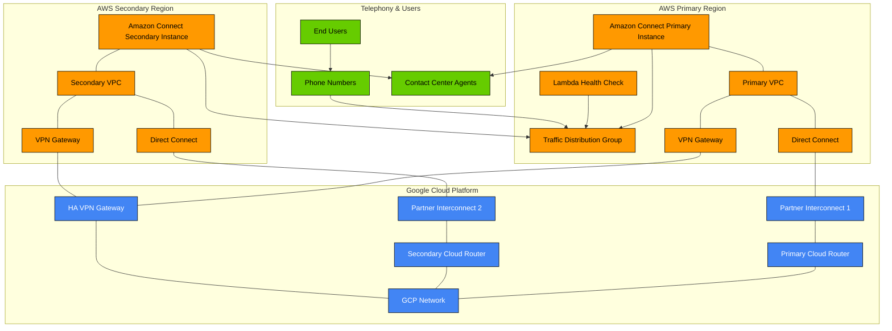

# Multi-Region Amazon Connect Implementation Guide

## Architecture Overview

This guide describes how to implement a highly available, multi-region Amazon Connect deployment that uses Google Cloud Router as the network core for interconnection between AWS regions.

The diagram below illustrates the complete architecture:



## Key Components

1. **Amazon Connect Instances**:
   - Primary instance in Region A (e.g., us-east-1)
   - Secondary instance in Region B (e.g., us-west-2)
   - Traffic Distribution Group for managing call routing

2. **Google Cloud Network Core**:
   - Cloud Routers in two regions for redundancy
   - Partner Interconnect attachments to AWS Direct Connect
   - Backup HA VPN tunnels for failover scenarios

3. **AWS Networking**:
   - VPCs in primary and secondary regions
   - Direct Connect to Google Cloud
   - VPN Gateways for backup connectivity

4. **Monitoring & Failover**:
   - Lambda-based health checks for automated failover
   - Cloud Monitoring alerts for interconnect status
   - Regular testing protocol for disaster recovery scenarios

## Implementation Steps

### Step 1: Deploy AWS CloudFormation Template

Deploy the provided CloudFormation template which creates:
- Amazon Connect instances in both regions
- VPC networking infrastructure
- Traffic Distribution Group
- Health check Lambda function

```bash
aws cloudformation deploy \
  --template-file amazon-connect-multiregion.yaml \
  --stack-name connect-multiregion \
  --parameter-overrides \
    PrimaryRegion=us-east-1 \
    SecondaryRegion=us-west-2 \
    ConnectInstanceAlias=my-contact-center \
    ConnectPhoneNumber=+18005551234 \
    GCPProjectID=my-gcp-project \
    VPCCIDRPrimary=10.0.0.0/16 \
    VPCCIDRSecondary=10.1.0.0/16 \
  --capabilities CAPABILITY_IAM
```

### Step 2: Deploy Google Cloud Deployment Manager Template

Deploy the provided Google Cloud configuration which creates:
- VPC network and subnets
- Cloud Routers in two regions
- Partner Interconnect attachments
- Firewall rules and health checks

```bash
gcloud deployment-manager deployments create connect-network-core \
  --template gcp-cloud-router.yaml \
  --properties \
    projectId:my-gcp-project,\
    awsPrimaryVpnIp:203.0.113.1,\
    awsSecondaryVpnIp:203.0.113.2,\
    vpnSharedSecret:your-secure-secret
```

### Step 3: Connect AWS Direct Connect to Google Cloud Partner Interconnect

1. Note the pairing keys from the Google Cloud deployment output:
   ```bash
   gcloud deployment-manager deployments describe connect-network-core \
     --format="value(outputs)"
   ```

2. In AWS, create a Direct Connect connection and associate it with Google Cloud Partner Interconnect:
   ```bash
   aws directconnect create-connection \
     --location location-code \
     --bandwidth 1Gbps \
     --connection-name GCP-Primary-Connection
   
   aws directconnect create-private-virtual-interface \
     --connection-id dxcon-abcdefg \
     --virtual-interface-name GCP-Primary-Interface \
     --vlan 100 \
     --asn 65000 \
     --amazon-address 169.254.0.1/30 \
     --customer-address 169.254.0.2/30 \
     --direct-connect-gateway-id dgw-12345 \
     --pairing-key primary-pairing-key-from-gcp
   ```

3. Repeat for the secondary region.

### Step 4: Configure Amazon Connect Contact Flows

1. Create identical contact flows in both regions
2. Set up agent routing profiles in both regions
3. Configure phone numbers in both regions
4. Test call routing through both primary and secondary paths

### Step 5: Set Up Monitoring and Alerting

1. Configure CloudWatch alarms in AWS:
   ```bash
   aws cloudwatch put-metric-alarm \
     --alarm-name ConnectInstanceHealth \
     --metric-name ThrottledCalls \
     --namespace AWS/Connect \
     --statistic Sum \
     --period 60 \
     --threshold 5 \
     --comparison-operator GreaterThanThreshold \
     --dimensions Name=InstanceId,Value=instance-id \
     --evaluation-periods 1 \
     --alarm-actions arn:aws:sns:region:account-id:topic-name
   ```

2. Set up Google Cloud Monitoring alerts for interconnect status.

3. Configure notification channels for operations team.

### Step 6: Implement Disaster Recovery Procedures

1. Document manual failover procedures
2. Establish regular testing schedule for DR scenarios
3. Create runbooks for common failure modes
4. Train operations staff on recovery procedures

## Testing the Setup

1. **Connectivity Testing**:
   ```bash
   # From EC2 instance in Primary VPC
   ping 192.168.1.1  # IP in Google Cloud
   
   # From Google Cloud instance
   ping 10.0.0.1  # IP in AWS Primary VPC
   ```

2. **Failover Testing**:
   - Simulate primary region failure
   - Verify traffic routes to secondary region
   - Test agent experience during failover
   - Validate customer call experience

3. **Latency Testing**:
   ```bash
   # Test round-trip time between regions
   traceroute 10.1.0.1  # From primary to secondary region
   ```

## Operational Considerations

1. **Monitoring**: Continuously monitor:
   - VPN and interconnect status
   - Amazon Connect instance health
   - Traffic distribution metrics
   - Agent login status across regions

2. **Cost Optimization**:
   - Consider reserved instances for cost savings
   - Monitor bandwidth costs for cross-region traffic
   - Evaluate Direct Connect vs. VPN cost tradeoffs

3. **Security**:
   - Implement encryption for data in transit
   - Set up security groups and VPC endpoints
   - Follow least privilege principle for IAM roles

4. **Performance**:
   - Monitor latency between regions
   - Optimize contact flows for performance
   - Consider regional agent routing for reduced latency

## Troubleshooting

### Common Issues and Resolutions

1. **Interconnect Connectivity Issues**:
   - Check BGP session status
   - Verify route advertisement
   - Check firewall rules

2. **Call Routing Problems**:
   - Verify Traffic Distribution Group settings
   - Check phone number configurations
   - Test contact flows in isolation

3. **Agent Connection Issues**:
   - Check agent network connectivity
   - Verify workstation settings
   - Test agent desktop application

## Regular Maintenance

1. Schedule quarterly failover tests
2. Update documentation after each test
3. Review and update contact flows in both regions
4. Audit security configurations

## Conclusion

This implementation provides a robust, multi-region Amazon Connect deployment with Google Cloud Router as the network core. By following this guide, you can ensure high availability for your contact center operations, with automated failover capabilities and comprehensive monitoring.
