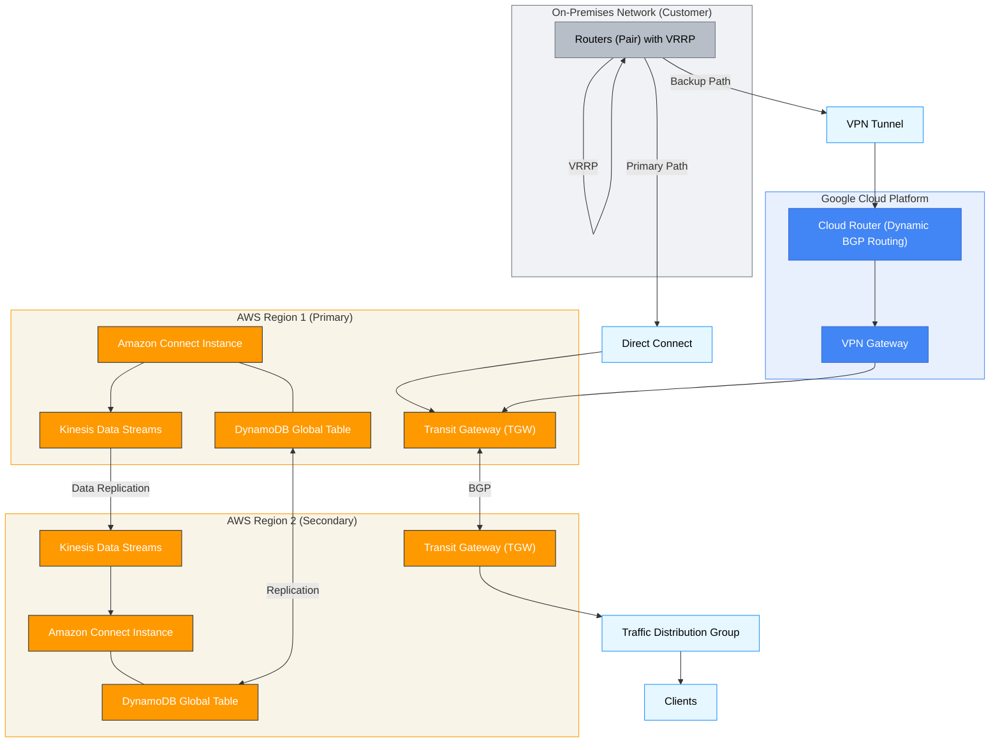

# Amazon Connect Multi-Region Resiliency Architecture

This document outlines the architecture for a highly available and resilient Amazon Connect deployment spanning two AWS regions (Primary and Secondary), leveraging Google Cloud Router, AWS Transit Gateway, Virtual Router Redundancy Protocol (VSRP), and associated components for data synchronization and failover.

## 1. Overview

This architecture provides an Active-Active/Active-Passive (depending on the traffic distribution configuration, as explained below) Amazon Connect solution.  It utilizes a primary and secondary AWS region to ensure business continuity in the event of an outage in a single region.  Key features include:

*   **Regional Redundancy:**  Separate Amazon Connect instances in two distinct AWS regions.
*   **Traffic Distribution:**  Traffic Distribution Groups (TDGs) control call routing between regions, allowing for active/active or active/passive setups.
*   **Real-time Data Synchronization:** Amazon Kinesis Data Streams replicate contact data between regions.
*   **Agent State Management:**  Amazon DynamoDB Global Tables maintain consistent agent state across regions.
*   **Automated Failover:**  AWS Lambda functions monitor instance health and trigger failover actions.
*   **Hybrid Network Connectivity:**  AWS Direct Connect (primary) with a VPN backup through Google Cloud Platform (GCP) using Google Cloud Router and AWS Transit Gateway for robust network connectivity.
* **High Availability Routing:** Uses BGP for dynamic route advertisement and VRRP for on-premises router redundancy.

## 2. Architecture Diagram

## 3. Components

### 3.1. AWS Components

*   **Amazon Connect Instances:** Two separate Amazon Connect instances, one in each AWS region.
*   **Traffic Distribution Groups (TDGs):**  TDGs allow you to define how incoming calls are distributed between the primary and secondary instances.  You can configure:
    *   **Active-Active:**  Distribute traffic across both instances (e.g., 50/50).
    *   **Active-Passive:**  Send 100% of traffic to the primary instance, switching to the secondary only during a failover.  This configuration is generally preferred for simpler failover management.
*   **Amazon Kinesis Data Streams:** Used for near real-time replication of contact data (e.g., Contact Trace Records - CTRs, recordings, chat transcripts) between the two Amazon Connect instances.  This ensures data consistency.
*   **Amazon DynamoDB Global Tables:** Provides a fully managed, multi-region, multi-master database for storing and synchronizing agent state information (e.g., agent status, login details, contact assignments).  Changes made in one region are automatically replicated to the other.
*   **AWS Lambda:**
    *   **Health Check Function:**  Monitors the health of the primary Amazon Connect instance and associated resources (e.g., Direct Connect, VPN, DynamoDB).
    *   **Failover Function:**  Triggered by the Health Check function upon detecting a failure.  This function modifies the TDG to redirect traffic to the secondary instance. It may also perform other failover actions, such as updating DNS records (if applicable).
*   **AWS Transit Gateway:**  Acts as a network transit hub, connecting VPCs and on-premises networks.  In this architecture, it simplifies connectivity between the Amazon Connect VPCs, the VPN connection from GCP, and the Direct Connect connection.  Each region has its own Transit Gateway.
*   **AWS Direct Connect:**  Provides a dedicated, high-bandwidth, low-latency network connection between your on-premises network and AWS.  This is the primary connection method.
* **Amazon CloudWatch:** Used to collect metrics to measure the health of the Connect instances, and the latency and status of network connections.

### 3.2. Google Cloud Platform (GCP) Components

*   **Google Cloud Router:**  A fully managed service that uses Border Gateway Protocol (BGP) to dynamically exchange routes between your VPC network and external networks.  It enables the VPN connection to be a backup for Direct Connect.
*   **Cloud VPN Gateway:** Establishes a secure, IPsec VPN connection between GCP and AWS Transit Gateway as a backup connection.
*   **VPC Network:**  A GCP VPC is required to host the Cloud Router and VPN Gateway.

### 3.3. On-Premises Components

*   **Routers (Pair):**  Your on-premises routers, configured with VRRP for high availability.  They connect to both the Direct Connect and the VPN tunnel via BGP.
*   **VRRP (Virtual Router Redundancy Protocol):**  Ensures that if one on-premises router fails, the other seamlessly takes over the shared virtual IP address, maintaining connectivity to both AWS and GCP.

### 3.4. Hybrid Connectivity and Routing

1.  **Primary Path (Direct Connect):**
    *   On-premises routers establish BGP sessions with AWS Transit Gateway over Direct Connect.
    *   Routes are advertised to AWS, directing traffic destined for the Amazon Connect instances via the Direct Connect link.
    *   BGP metrics (e.g., AS Path Prepending, Local Preference) are used to prefer Direct Connect as the primary path.

2.  **Backup Path (VPN via GCP):**
    *   On-premises routers also establish BGP sessions with Google Cloud Router.
    *   Google Cloud Router, in turn, establishes BGP sessions with the AWS Transit Gateway over the Cloud VPN connection.
    *   BGP metrics are configured to make this path less preferred (e.g., longer AS Path).
    *   If Direct Connect fails, BGP will automatically detect the path loss and begin routing traffic over the VPN.

3.  **Active-Active Routing (Optional):**
    *   If you desire active-active routing at the network layer, you can adjust BGP metrics to load balance traffic across both Direct Connect and VPN connections.  This requires careful configuration to avoid asymmetric routing.

4. **Route Propagation:**
   * AWS Transit Gateways, upon recieving routes from GCP, will propagate them to the Connect VPCs.
   * AWS Transit Gateways will also propgate routes learned from the on-premises environment via Direct Connect, to GCP and vice versa.

## 4. Failover Process

1.  **Monitoring:**  The Lambda Health Check function continuously monitors the health of the primary Amazon Connect instance and network connectivity.
2.  **Failure Detection:**  If the primary instance or connectivity fails (as determined by CloudWatch metrics or custom health checks), the Health Check function triggers the Failover Lambda function.
3.  **Traffic Redirection:**  The Failover Lambda function modifies the Traffic Distribution Group (TDG) to redirect 100% of incoming traffic to the secondary Amazon Connect instance.
4.  **Agent Failover:**  Agents logged into the primary instance will be automatically logged out (due to the instance becoming unavailable). They can then log into the secondary instance.  Their state is preserved in the DynamoDB Global Table, so they can resume work with minimal disruption.
5.  **Network Failover:**  BGP automatically detects the failure of the Direct Connect connection and shifts traffic to the VPN path via GCP.
6.  **Recovery:**  Once the primary instance or connectivity is restored, the Lambda function can be configured to automatically fail back (recommended) or require manual intervention to switch back to the primary (for more controlled failback).  This typically involves adjusting the TDG again.

## 5. Data Synchronization Details

*   **Kinesis Data Streams:** Contact data from the primary instance is streamed in near real-time to Kinesis.  A Lambda function (or Kinesis Data Firehose) in the secondary region consumes this data and updates the secondary Amazon Connect instance. This may involve:
    *   Updating Contact Records.
    *   Copying call recordings and chat transcripts to S3 buckets in the secondary region.
    *   Replicating any custom data stored in other AWS services.
*   **DynamoDB Global Tables:**  Agent state changes are automatically replicated across regions. This ensures agents can seamlessly transition between instances without losing context.
* **Conflict Resolution**: Because Kinesis offers at-least-once delivery, there is the possiblity of records being delivered more than once. The data replication mechanism must be idempotent. DynamoDB global tables handle conflict resolution automatically based on a "last writer wins" strategy.

## 6. Security Considerations

*   **IAM Roles and Permissions:**  Use least-privilege IAM roles for all AWS resources (Lambda functions, Kinesis streams, DynamoDB, etc.) to restrict access only to necessary resources.
*   **Network Security:**
    *   Use Security Groups and Network ACLs to control traffic flow within your VPCs.
    *   Ensure the VPN connection between GCP and AWS is properly configured with strong encryption.
    *   Configure appropriate routing policies to prevent unintended traffic exposure.
*   **Data Encryption:**
    *   Enable encryption at rest for data in Kinesis, DynamoDB, and S3.
    *   Use HTTPS for all communication between services.
*   **Monitoring and Logging:**
    *   Enable CloudTrail logging to track API calls and changes to your AWS environment.
    *   Configure CloudWatch alarms to notify you of any critical events or failures.

## 7. Key Configuration Steps

1.  **Provision Resources:** Create all necessary AWS and GCP resources (Amazon Connect instances, DynamoDB tables, Kinesis streams, Lambda functions, Transit Gateways, Cloud Router, VPN Gateway, etc.).
2.  **Configure Network Connectivity:**
    *   Establish Direct Connect connection.
    *   Configure VPN connection between GCP and AWS.
    *   Configure BGP routing between on-premises routers, Google Cloud Router, and AWS Transit Gateway.
    *   Configure VRRP on on-premises routers.
3.  **Set up Data Synchronization:**
    *   Configure Kinesis Data Streams for data replication.
    *   Create DynamoDB Global Tables for agent state.
4.  **Configure Traffic Distribution:** Create and configure the Traffic Distribution Group.
5.  **Implement Failover Logic:**
    *   Develop and deploy Lambda functions for health checks and failover.
    *   Configure CloudWatch alarms to trigger the health check Lambda.
6.  **Testing:** Thoroughly test the failover process to ensure it works as expected. This includes simulated failures of the primary instance and network connections.

## 8. Conclusion

This architecture provides a highly resilient and scalable solution for Amazon Connect, levera
