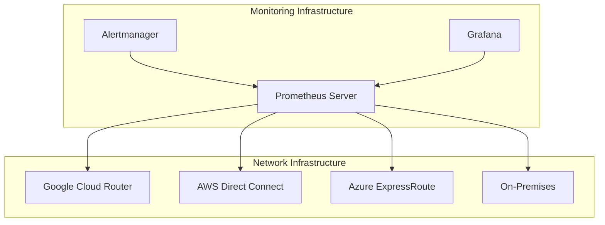

# Core Network Infrastructure Security and Monitoring Guide

## Table of Contents
1. [Infrastructure Overview](#infrastructure-overview)
2. [Route Configuration](#route-configuration)
3. [Security Implementation](#security-implementation)
4. [Prometheus Monitoring Setup](#prometheus-monitoring-setup)
5. [Verification Procedures](#verification-procedures)
6. [Alerting Configuration](#alerting-configuration)

## Infrastructure Overview



## Prerequisites

### Environment Variables
```bash
# Core Network Variables
export PROJECT_ID="your-project-id"
export NETWORK_NAME="core-network"
export PROMETHEUS_VERSION="2.45.0"

# CIDR Ranges
export GCP_CIDR="10.0.0.0/16"
export AWS_CIDR="172.16.0.0/16"
export AZURE_CIDR="192.168.0.0/16"
export ONPREM_CIDR="10.100.0.0/16"
```

## Route Configuration

### 1. Route Advertisement Setup

```bash
# Configure GCP route advertisements
gcloud compute routers update core-router \
    --project=${PROJECT_ID} \
    --region=us-central1 \
    --advertisement-mode=custom \
    --advertised-ranges=${GCP_CIDR} \
    --add-advertisement-ranges=${AWS_CIDR},${AZURE_CIDR},${ONPREM_CIDR}

# Configure route priorities
gcloud compute routers update-bgp-peer core-router \
    --peer-name=aws-peer \
    --advertised-route-priority=100
gcloud compute routers update-bgp-peer core-router \
    --peer-name=azure-peer \
    --advertised-route-priority=200
```

### 2. Route Policy Configuration

```bash
# Create route policy for traffic control
cat << EOF > route-policy.yaml
apiVersion: compute.cnrm.cloud.google.com/v1beta1
kind: ComputeRoute
metadata:
  name: priority-route
spec:
  destRange: ${AWS_CIDR}
  priority: 100
  nextHopGateway: projects/${PROJECT_ID}/global/gateways/default-internet-gateway
EOF

kubectl apply -f route-policy.yaml
```

## Security Implementation

### 1. Core Firewall Rules

```bash
# Create base firewall rules
gcloud compute firewall-rules create allow-internal-traffic \
    --project=${PROJECT_ID} \
    --network=${NETWORK_NAME} \
    --direction=INGRESS \
    --priority=1000 \
    --source-ranges=${GCP_CIDR},${AWS_CIDR},${AZURE_CIDR},${ONPREM_CIDR} \
    --action=ALLOW \
    --rules=tcp,udp,icmp \
    --target-tags=internal

# Create monitoring firewall rules
gcloud compute firewall-rules create allow-prometheus \
    --project=${PROJECT_ID} \
    --network=${NETWORK_NAME} \
    --direction=INGRESS \
    --priority=1000 \
    --source-ranges=${GCP_CIDR} \
    --action=ALLOW \
    --rules=tcp:9090,tcp:9093,tcp:9094,tcp:3000
```

### 2. Security Groups Configuration

```bash
# Create network security policies
cat << EOF > security-policy.yaml
apiVersion: networking.k8s.io/v1
kind: NetworkPolicy
metadata:
  name: core-network-policy
spec:
  podSelector: {}
  policyTypes:
  - Ingress
  - Egress
  ingress:
  - from:
    - ipBlock:
        cidr: ${GCP_CIDR}
    ports:
    - protocol: TCP
      port: 9090
  egress:
  - to:
    - ipBlock:
        cidr: 0.0.0.0/0
        except:
        - 169.254.169.254/32
EOF

kubectl apply -f security-policy.yaml
```

## Prometheus Monitoring Setup

### 1. Install Prometheus

```bash
# Create Prometheus namespace
kubectl create namespace monitoring

# Install Prometheus using Helm
helm repo add prometheus-community https://prometheus-community.github.io/helm-charts
helm repo update

helm install prometheus prometheus-community/kube-prometheus-stack \
    --namespace monitoring \
    --values prometheus-values.yaml
```

### 2. Configure Prometheus Scrape Jobs

```yaml
# prometheus-values.yaml
prometheus:
  prometheusSpec:
    scrapeInterval: 15s
    evaluationInterval: 15s
    scrapeTimeout: 10s
    additionalScrapeConfigs:
      - job_name: 'google-cloud-router'
        static_configs:
          - targets: ['core-router:9100']
        metrics_path: /metrics
        scheme: https
        tls_config:
          insecure_skip_verify: true
      - job_name: 'aws-direct-connect'
        static_configs:
          - targets: ['aws-router:9100']
      - job_name: 'azure-expressroute'
        static_configs:
          - targets: ['azure-router:9100']
```

### 3. Configure Alertmanager

```yaml
# alertmanager-config.yaml
global:
  resolve_timeout: 5m

route:
  group_by: ['alertname', 'job']
  group_wait: 30s
  group_interval: 5m
  repeat_interval: 12h
  receiver: 'slack'

receivers:
- name: 'slack'
  slack_configs:
  - api_url: 'https://hooks.slack.com/services/YOUR/SLACK/WEBHOOK'
    channel: '#network-alerts'
    send_resolved: true
```

## Verification Procedures

### 1. BGP Session Verification

```bash
# Check BGP session status
gcloud compute routers get-status core-router \
    --project=${PROJECT_ID} \
    --region=us-central1 \
    --format='table(result.bgpPeerStatus[].name,result.bgpPeerStatus[].ipAddress,result.bgpPeerStatus[].status)'

# Verify route exchange
gcloud compute routes list \
    --project=${PROJECT_ID} \
    --filter="network=${NETWORK_NAME}"
```

### 2. Network Connectivity Tests

```bash
# Create test instances
gcloud compute instances create network-test \
    --project=${PROJECT_ID} \
    --zone=us-central1-a \
    --machine-type=e2-micro \
    --network=${NETWORK_NAME} \
    --subnet=default

# Run connectivity tests
for CIDR in ${GCP_CIDR} ${AWS_CIDR} ${AZURE_CIDR} ${ONPREM_CIDR}; do
    gcloud compute networks subnets get-diagnostic \
        --project=${PROJECT_ID} \
        --region=us-central1 \
        --subnet=default \
        --destination=${CIDR}
done
```

## Alerting Configuration

### 1. Prometheus Alert Rules

```yaml
# prometheus-rules.yaml
groups:
- name: network-alerts
  rules:
  - alert: BGPSessionDown
    expr: bgp_session_up == 0
    for: 5m
    labels:
      severity: critical
    annotations:
      summary: "BGP session down"
      description: "BGP session {{ $labels.peer }} has been down for 5 minutes"

  - alert: HighLatency
    expr: network_latency_milliseconds > 100
    for: 5m
    labels:
      severity: warning
    annotations:
      summary: "High network latency"
      description: "Network latency is above 100ms for 5 minutes"

  - alert: BandwidthUtilization
    expr: rate(network_bytes_total[5m]) > 8e8
    for: 5m
    labels:
      severity: warning
    annotations:
      summary: "High bandwidth utilization"
      description: "Network bandwidth utilization exceeds 80% for 5 minutes"
```

### 2. Custom Dashboards

```bash
# Install Grafana dashboard
kubectl apply -f - <<EOF
apiVersion: v1
kind: ConfigMap
metadata:
  name: network-dashboard
  namespace: monitoring
data:
  network-overview.json: |
    {
      "dashboard": {
        "title": "Network Overview",
        "panels": [
          {
            "title": "BGP Session Status",
            "type": "stat",
            "targets": [
              {
                "expr": "bgp_session_up",
                "legendFormat": "{{peer}}"
              }
            ]
          },
          {
            "title": "Network Latency",
            "type": "graph",
            "targets": [
              {
                "expr": "rate(network_latency_milliseconds[5m])",
                "legendFormat": "{{destination}}"
              }
            ]
          }
        ]
      }
    }
EOF
```

### 3. Monitoring Best Practices

1. Regular Checks:
   - Monitor BGP session status every 5 minutes
   - Check route table updates every 15 minutes
   - Verify bandwidth utilization every minute
   - Monitor latency between regions continuously

2. Alert Thresholds:
   - BGP session down: Critical alert after 5 minutes
   - Latency > 100ms: Warning alert
   - Bandwidth utilization > 80%: Warning alert
   - Route flapping: Critical alert

3. Documentation Requirements:
   - Maintain current network topology diagram
   - Document all BGP peers and ASNs
   - Keep security policy documentation updated
   - Record all alert thresholds and justification

Remember to:
1. Replace placeholder values with actual configuration
2. Secure all credentials and sensitive information
3. Regularly test alerting mechanisms
4. Update monitoring rules as infrastructure changes
5. Keep backups of all configurations
6. Document all custom metrics and alert rules
7. Maintain runbooks for common issues
8. Schedule regular review of security policies