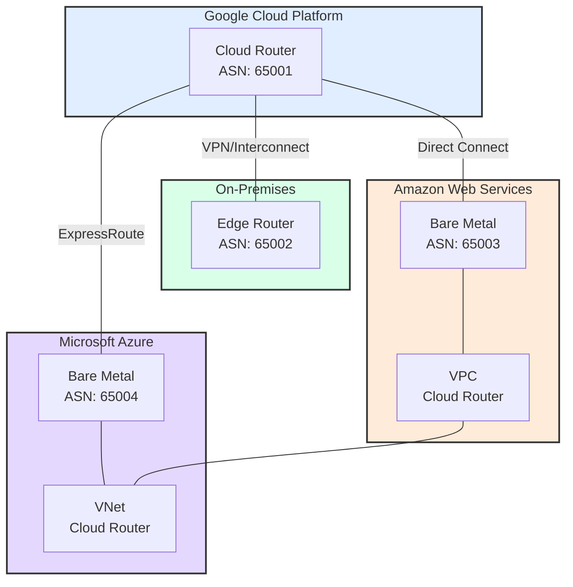

# Multi-Cloud Network Architecture Implementation Guide

This guide provides step-by-step instructions for implementing a Google Cloud-based network backbone that interconnects multiple cloud environments and on-premises infrastructure.

## Network Architecture

The following diagram illustrates the overall network architecture and connectivity between different cloud environments:



## Prerequisites

- Active accounts in Google Cloud Platform, AWS, and Azure
- Administrative access to all cloud environments
- On-premises network infrastructure with BGP-capable edge routers
- Reserved IP address ranges (CIDR blocks) for each environment
- Required network connectivity permissions in all environments

## Implementation Steps

### 1. Google Cloud Core Network Setup

1.1. Create the Core VPC Network
```bash
gcloud compute networks create core-network --subnet-mode=custom
```

1.2. Create Necessary Subnets
```bash
gcloud compute networks subnets create core-subnet \
    --network=core-network \
    --region=YOUR_REGION \
    --range=YOUR_CIDR_RANGE
```

1.3. Configure Cloud Router
```bash
gcloud compute routers create core-router \
    --network=core-network \
    --region=YOUR_REGION \
    --asn=65001
```

### 2. On-Premises Connectivity

2.1. For VPN Connection:
```bash
# Create VPN Gateway
gcloud compute vpn-gateways create onprem-gateway \
    --network=core-network \
    --region=YOUR_REGION

# Create VPN Tunnel
gcloud compute vpn-tunnels create onprem-tunnel \
    --peer-address=YOUR_ONPREM_IP \
    --shared-secret=YOUR_SECRET \
    --region=YOUR_REGION \
    --ike-version=2 \
    --router=core-router
```

2.2. For Dedicated Interconnect:
- Order a cross-connect from your colocation provider
- Create an Interconnect attachment in Google Cloud
- Configure BGP peering with ASN 65002

### 3. AWS Integration

3.1. Set up Direct Connect
- Order Direct Connect through AWS Console
- Create a Direct Connect Gateway
- Associate with your VPC

3.2. Configure AWS VPC
```bash
# Using AWS CLI
aws ec2 create-vpc --cidr-block YOUR_AWS_CIDR
aws ec2 create-vpn-gateway --type ipsec.1
```

3.3. Establish BGP Peering
- Configure AWS Direct Connect router with ASN 65003
- Set up BGP session with Google Cloud Router
- Verify route exchange

### 4. Azure Integration

4.1. Set up ExpressRoute
```bash
# Using Azure CLI
az network express-route create \
    --name azure-expressroute \
    --resource-group YOUR_RG \
    --location YOUR_LOCATION \
    --bandwidth 1000 \
    --provider YOUR_PROVIDER
```

4.2. Configure Azure VNet
```bash
az network vnet create \
    --name azure-vnet \
    --resource-group YOUR_RG \
    --location YOUR_LOCATION \
    --address-prefix YOUR_AZURE_CIDR
```

4.3. Establish BGP Peering
- Configure ExpressRoute circuit with ASN 65004
- Set up BGP session with Google Cloud Router
- Verify route exchange

### 5. Route Configuration

5.1. Configure Route Advertisements
```bash
# In Google Cloud Router
gcloud compute routers update core-router \
    --advertisement-mode=custom \
    --advertised-ranges=YOUR_RANGES
```

5.2. Define Route Policies
- Set up route filters to control traffic flow
- Implement route summarization where possible
- Configure failover routes

### 6. Security Implementation

6.1. Configure Firewall Rules
```bash
# Google Cloud
gcloud compute firewall-rules create allow-internal \
    --network=core-network \
    --allow=tcp,udp,icmp \
    --source-ranges=YOUR_RANGES

# Configure similar rules in AWS and Azure
```

6.2. Set up Network Security Groups
- Define inbound and outbound rules
- Implement least privilege access
- Document all security policies

### 7. Monitoring Setup

7.1. Enable Cloud Monitoring
```bash
gcloud services enable monitoring.googleapis.com
```

7.2. Configure Alerts
- Set up latency thresholds
- Monitor BGP session status
- Configure bandwidth utilization alerts

## Verification Steps

1. Verify BGP Sessions
```bash
gcloud compute routers get-status core-router \
    --region=YOUR_REGION
```

2. Test Connectivity
- Perform ping tests between environments
- Verify application-level connectivity
- Test failover scenarios

3. Monitor Performance
- Check latency between environments
- Verify bandwidth utilization
- Monitor route stability

## Troubleshooting

Common issues and their solutions:

1. BGP Session Issues
- Verify ASN configurations
- Check BGP timers
- Confirm route advertisements

2. Connectivity Problems
- Verify firewall rules
- Check route tables
- Confirm CIDR configurations

3. Performance Issues
- Monitor bandwidth utilization
- Check for route flapping
- Verify QoS settings

## Maintenance Procedures

1. Regular Tasks
- Monitor BGP session health
- Review firewall rules
- Update route policies as needed
- Perform failover testing

2. Backup Procedures
- Document all configurations
- Maintain configuration backups
- Test restoration procedures

## Best Practices

1. Network Design
- Use consistent naming conventions
- Implement redundancy where possible
- Document all configurations

2. Security
- Regular security audits
- Maintain least privilege access
- Monitor security logs

3. Performance
- Regular performance testing
- Capacity planning
- Monitor resource utilization

## Support and Escalation

1. First Level Support
- Basic connectivity issues
- Firewall rule changes
- Route updates

2. Second Level Support
- BGP session problems
- Performance issues
- Complex routing problems

3. Escalation Path
- Define escalation procedures
- Document contact information
- Establish SLAs

## Documentation

Maintain detailed documentation for:
- Network topology
- IP address assignments
- BGP configurations
- Firewall rules
- Change management procedures
- Incident response plans

Remember to update this documentation regularly as your network evolves.