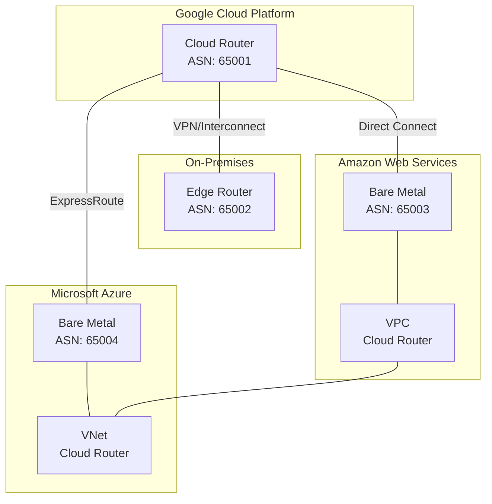
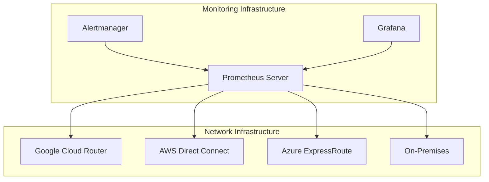

# Multi-Cloud Network Architecture Implementation Guide

## Table of Contents
1. [Network Overview](#infrastructure-overview)
2. [On-Prem Core Network](#2-on-premises-connectivity)
3. [Routing Configurations](#5-route-configuration)
4. [Security Infrastructure Overview](#core-network-infrastructure-security-and-monitoring-guide)
5. [Route Configuration](#route-configuration)
6. [Security Implementation](#security-implementation)
7. [Prometheus Monitoring Setup](#prometheus-monitoring-setup)
8. [Verification Procedures](#verification-procedures)
9. [Alerting Configuration](#alerting-configuration)

## Infrastructure Overview

This guide provides step-by-step instructions for implementing a Google Cloud-based network backbone that interconnects multiple cloud environments and on-premises infrastructure.

## Network Architecture

The following diagram illustrates the overall network architecture and connectivity between different cloud environments:



## Prerequisites

- Active accounts in Google Cloud Platform, AWS, and Azure
- Administrative access to all cloud environments
- On-premises network infrastructure with BGP-capable edge routers
- Reserved IP address ranges (CIDR blocks) for each environment
- Required network connectivity permissions in all environments

## Network Core Implementation Overview

### 1. Google Cloud Core Network Setup

1.1. Create the Core VPC Network
```bash
gcloud compute networks create core-network --subnet-mode=custom
```

1.2. Create Necessary Subnets
```bash
gcloud compute networks subnets create core-subnet \
    --network=core-network \
    --region=YOUR_REGION \
    --range=YOUR_CIDR_RANGE
```

1.3. Configure Cloud Router
```bash
gcloud compute routers create core-router \
    --network=core-network \
    --region=YOUR_REGION \
    --asn=65001
```

### 2. On-Premises Connectivity

2.1. For VPN Connection:
```bash
# Create VPN Gateway
gcloud compute vpn-gateways create onprem-gateway \
    --network=core-network \
    --region=YOUR_REGION

# Create VPN Tunnel
gcloud compute vpn-tunnels create onprem-tunnel \
    --peer-address=YOUR_ONPREM_IP \
    --shared-secret=YOUR_SECRET \
    --region=YOUR_REGION \
    --ike-version=2 \
    --router=core-router
```

2.2. For Dedicated Interconnect:
- Order a cross-connect from your colocation provider
- Create an Interconnect attachment in Google Cloud
- Configure BGP peering with ASN 65002

### 3. AWS Integration

3.1. Set up Direct Connect
- Order Direct Connect through AWS Console
- Create a Direct Connect Gateway
- Associate with your VPC

3.2. Configure AWS VPC
```bash
# Using AWS CLI
aws ec2 create-vpc --cidr-block YOUR_AWS_CIDR
aws ec2 create-vpn-gateway --type ipsec.1
```

3.3. Establish BGP Peering
- Configure AWS Direct Connect router with ASN 65003
- Set up BGP session with Google Cloud Router
- Verify route exchange

### 4. Azure Integration

4.1. Set up ExpressRoute
```bash
# Using Azure CLI
az network express-route create \
    --name azure-expressroute \
    --resource-group YOUR_RG \
    --location YOUR_LOCATION \
    --bandwidth 1000 \
    --provider YOUR_PROVIDER
```

4.2. Configure Azure VNet
```bash
az network vnet create \
    --name azure-vnet \
    --resource-group YOUR_RG \
    --location YOUR_LOCATION \
    --address-prefix YOUR_AZURE_CIDR
```

4.3. Establish BGP Peering
- Configure ExpressRoute circuit with ASN 65004
- Set up BGP session with Google Cloud Router
- Verify route exchange

### 5. Route Configuration

5.1. Configure Route Advertisements
```bash
# In Google Cloud Router
gcloud compute routers update core-router \
    --advertisement-mode=custom \
    --advertised-ranges=YOUR_RANGES
```

5.2. Define Route Policies
- Set up route filters to control traffic flow
- Implement route summarization where possible
- Configure failover routes

### 6. Security Implementation Overview

6.1. Configure Firewall Rules
```bash
# Google Cloud
gcloud compute firewall-rules create allow-internal \
    --network=core-network \
    --allow=tcp,udp,icmp \
    --source-ranges=YOUR_RANGES

# Configure similar rules in AWS and Azure
```

6.2. Set up Network Security Groups
- Define inbound and outbound rules
- Implement least privilege access
- Document all security policies

### 7. Monitoring Setup

7.1. Enable Cloud Monitoring
```bash
gcloud services enable monitoring.googleapis.com
```

7.2. Configure Alerts
- Set up latency thresholds
- Monitor BGP session status
- Configure bandwidth utilization alerts

## Verification Steps

1. Verify BGP Sessions
```bash
gcloud compute routers get-status core-router \
    --region=YOUR_REGION
```

2. Test Connectivity
- Perform ping tests between environments
- Verify application-level connectivity
- Test failover scenarios

3. Monitor Performance
- Check latency between environments
- Verify bandwidth utilization
- Monitor route stability

## Troubleshooting

Common issues and their solutions:

1. BGP Session Issues
- Verify ASN configurations
- Check BGP timers
- Confirm route advertisements

2. Connectivity Problems
- Verify firewall rules
- Check route tables
- Confirm CIDR configurations

3. Performance Issues
- Monitor bandwidth utilization
- Check for route flapping
- Verify QoS settings

## Maintenance Procedures

1. Regular Tasks
- Monitor BGP session health
- Review firewall rules
- Update route policies as needed
- Perform failover testing

2. Backup Procedures
- Document all configurations
- Maintain configuration backups
- Test restoration procedures

## Best Practices

1. Network Design
- Use consistent naming conventions
- Implement redundancy where possible
- Document all configurations

2. Security
- Regular security audits
- Maintain least privilege access
- Monitor security logs

3. Performance
- Regular performance testing
- Capacity planning
- Monitor resource utilization

## Support and Escalation

1. First Level Support
- Basic connectivity issues
- Firewall rule changes
- Route updates

2. Second Level Support
- BGP session problems
- Performance issues
- Complex routing problems

3. Escalation Path
- Define escalation procedures
- Document contact information
- Establish SLAs

## Documentation

Maintain detailed documentation for:
- Network topology
- IP address assignments
- BGP configurations
- Firewall rules
- Change management procedures
- Incident response plans

# Core Network Infrastructure Security and Monitoring Guide



## Prerequisites

### Environment Variables
```bash
# Core Network Variables
export PROJECT_ID="your-project-id"
export NETWORK_NAME="core-network"
export PROMETHEUS_VERSION="2.45.0"

# CIDR Ranges
export GCP_CIDR="10.0.0.0/16"
export AWS_CIDR="172.16.0.0/16"
export AZURE_CIDR="192.168.0.0/16"
export ONPREM_CIDR="10.100.0.0/16"
```

## Route Configuration

### 1. Route Advertisement Setup

```bash
# Configure GCP route advertisements
gcloud compute routers update core-router \
    --project=${PROJECT_ID} \
    --region=us-central1 \
    --advertisement-mode=custom \
    --advertised-ranges=${GCP_CIDR} \
    --add-advertisement-ranges=${AWS_CIDR},${AZURE_CIDR},${ONPREM_CIDR}

# Configure route priorities
gcloud compute routers update-bgp-peer core-router \
    --peer-name=aws-peer \
    --advertised-route-priority=100
gcloud compute routers update-bgp-peer core-router \
    --peer-name=azure-peer \
    --advertised-route-priority=200
```

### 2. Route Policy Configuration

```bash
# Create route policy for traffic control
cat << EOF > route-policy.yaml
apiVersion: compute.cnrm.cloud.google.com/v1beta1
kind: ComputeRoute
metadata:
  name: priority-route
spec:
  destRange: ${AWS_CIDR}
  priority: 100
  nextHopGateway: projects/${PROJECT_ID}/global/gateways/default-internet-gateway
EOF

kubectl apply -f route-policy.yaml
```

## Security Implementation

### 1. Core Firewall Rules

```bash
# Create base firewall rules
gcloud compute firewall-rules create allow-internal-traffic \
    --project=${PROJECT_ID} \
    --network=${NETWORK_NAME} \
    --direction=INGRESS \
    --priority=1000 \
    --source-ranges=${GCP_CIDR},${AWS_CIDR},${AZURE_CIDR},${ONPREM_CIDR} \
    --action=ALLOW \
    --rules=tcp,udp,icmp \
    --target-tags=internal

# Create monitoring firewall rules
gcloud compute firewall-rules create allow-prometheus \
    --project=${PROJECT_ID} \
    --network=${NETWORK_NAME} \
    --direction=INGRESS \
    --priority=1000 \
    --source-ranges=${GCP_CIDR} \
    --action=ALLOW \
    --rules=tcp:9090,tcp:9093,tcp:9094,tcp:3000
```

### 2. Security Groups Configuration

```bash
# Create network security policies
cat << EOF > security-policy.yaml
apiVersion: networking.k8s.io/v1
kind: NetworkPolicy
metadata:
  name: core-network-policy
spec:
  podSelector: {}
  policyTypes:
  - Ingress
  - Egress
  ingress:
  - from:
    - ipBlock:
        cidr: ${GCP_CIDR}
    ports:
    - protocol: TCP
      port: 9090
  egress:
  - to:
    - ipBlock:
        cidr: 0.0.0.0/0
        except:
        - 169.254.169.254/32
EOF

kubectl apply -f security-policy.yaml
```

## Prometheus Monitoring Setup

### 1. Install Prometheus

```bash
# Create Prometheus namespace
kubectl create namespace monitoring

# Install Prometheus using Helm
helm repo add prometheus-community https://prometheus-community.github.io/helm-charts
helm repo update

helm install prometheus prometheus-community/kube-prometheus-stack \
    --namespace monitoring \
    --values prometheus-values.yaml
```

### 2. Configure Prometheus Scrape Jobs

```yaml
# prometheus-values.yaml
prometheus:
  prometheusSpec:
    scrapeInterval: 15s
    evaluationInterval: 15s
    scrapeTimeout: 10s
    additionalScrapeConfigs:
      - job_name: 'google-cloud-router'
        static_configs:
          - targets: ['core-router:9100']
        metrics_path: /metrics
        scheme: https
        tls_config:
          insecure_skip_verify: true
      - job_name: 'aws-direct-connect'
        static_configs:
          - targets: ['aws-router:9100']
      - job_name: 'azure-expressroute'
        static_configs:
          - targets: ['azure-router:9100']
```

### 3. Configure Alertmanager

```yaml
# alertmanager-config.yaml
global:
  resolve_timeout: 5m

route:
  group_by: ['alertname', 'job']
  group_wait: 30s
  group_interval: 5m
  repeat_interval: 12h
  receiver: 'slack'

receivers:
- name: 'slack'
  slack_configs:
  - api_url: 'https://hooks.slack.com/services/YOUR/SLACK/WEBHOOK'
    channel: '#network-alerts'
    send_resolved: true
```

## Verification Procedures

### 1. BGP Session Verification

```bash
# Check BGP session status
gcloud compute routers get-status core-router \
    --project=${PROJECT_ID} \
    --region=us-central1 \
    --format='table(result.bgpPeerStatus[].name,result.bgpPeerStatus[].ipAddress,result.bgpPeerStatus[].status)'

# Verify route exchange
gcloud compute routes list \
    --project=${PROJECT_ID} \
    --filter="network=${NETWORK_NAME}"
```

### 2. Network Connectivity Tests

```bash
# Create test instances
gcloud compute instances create network-test \
    --project=${PROJECT_ID} \
    --zone=us-central1-a \
    --machine-type=e2-micro \
    --network=${NETWORK_NAME} \
    --subnet=default

# Run connectivity tests
for CIDR in ${GCP_CIDR} ${AWS_CIDR} ${AZURE_CIDR} ${ONPREM_CIDR}; do
    gcloud compute networks subnets get-diagnostic \
        --project=${PROJECT_ID} \
        --region=us-central1 \
        --subnet=default \
        --destination=${CIDR}
done
```

## Alerting Configuration

### 1. Prometheus Alert Rules

```yaml
# prometheus-rules.yaml
groups:
- name: network-alerts
  rules:
  - alert: BGPSessionDown
    expr: bgp_session_up == 0
    for: 5m
    labels:
      severity: critical
    annotations:
      summary: "BGP session down"
      description: "BGP session {{ $labels.peer }} has been down for 5 minutes"

  - alert: HighLatency
    expr: network_latency_milliseconds > 100
    for: 5m
    labels:
      severity: warning
    annotations:
      summary: "High network latency"
      description: "Network latency is above 100ms for 5 minutes"

  - alert: BandwidthUtilization
    expr: rate(network_bytes_total[5m]) > 8e8
    for: 5m
    labels:
      severity: warning
    annotations:
      summary: "High bandwidth utilization"
      description: "Network bandwidth utilization exceeds 80% for 5 minutes"
```

### 2. Custom Dashboards

```bash
# Install Grafana dashboard
kubectl apply -f - <<EOF
apiVersion: v1
kind: ConfigMap
metadata:
  name: network-dashboard
  namespace: monitoring
data:
  network-overview.json: |
    {
      "dashboard": {
        "title": "Network Overview",
        "panels": [
          {
            "title": "BGP Session Status",
            "type": "stat",
            "targets": [
              {
                "expr": "bgp_session_up",
                "legendFormat": "{{peer}}"
              }
            ]
          },
          {
            "title": "Network Latency",
            "type": "graph",
            "targets": [
              {
                "expr": "rate(network_latency_milliseconds[5m])",
                "legendFormat": "{{destination}}"
              }
            ]
          }
        ]
      }
    }
EOF
```

### 3. Monitoring Best Practices

1. Regular Checks:
   - Monitor BGP session status every 5 minutes
   - Check route table updates every 15 minutes
   - Verify bandwidth utilization every minute
   - Monitor latency between regions continuously

2. Alert Thresholds:
   - BGP session down: Critical alert after 5 minutes
   - Latency > 100ms: Warning alert
   - Bandwidth utilization > 80%: Warning alert
   - Route flapping: Critical alert

3. Documentation Requirements:
   - Maintain current network topology diagram
   - Document all BGP peers and ASNs
   - Keep security policy documentation updated
   - Record all alert thresholds and justification

Remember to:
1. Replace placeholder values with actual configuration
2. Secure all credentials and sensitive information
3. Regularly test alerting mechanisms
4. Update monitoring rules as infrastructure changes
5. Keep backups of all configurations
6. Document all custom metrics and alert rules
7. Maintain runbooks for common issues
8. Schedule regular review of security policies
