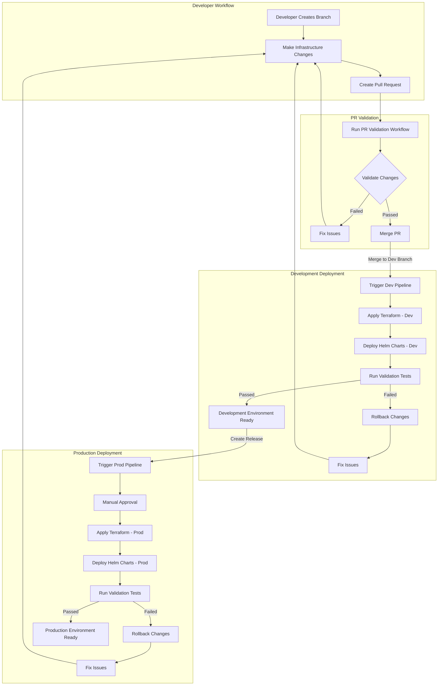

# GKE Infrastructure Automation Implementation Guide

This guide provides detailed steps for deploying and managing Google Kubernetes Engine (GKE) by giving github actions direct IAM permissions to push/write infrastructure updates to GCP, 

## THIS IS JUST TO DOCUMENT WHATS POSSIBLE BUT NOT RECOMMENDED BECAUSE IT IS NOT THE MOST SECURE STRATEGY

## Table of Contents
- [Prerequisites](#prerequisites)
- [Repository Structure](#repository-structure)
- [Step 1: Environment Setup](#step-1-environment-setup)
- [Step 2: Configure Terraform](#step-2-configure-terraform)
- [Step 3: Configure Helm Charts](#step-3-configure-helm-charts)
- [Step 4: Set Up GitHub Actions Workflows](#step-4-set-up-github-actions-workflows)
- [Step 5: Testing Your Infrastructure](#step-5-testing-your-infrastructure)
- [Step 6: Deploy to Development](#step-6-deploy-to-development)
- [Step 7: Deploy to Production](#step-7-deploy-to-production)
- [Maintenance and Operations](#maintenance-and-operations)
- [Troubleshooting](#troubleshooting)

## Prerequisites

Before starting the implementation, ensure you have the following:

- Google Cloud Platform (GCP) account with appropriate permissions
- `gcloud` CLI installed and configured
- Terraform (v1.0.0+) installed
- Helm (v3.0.0+) installed
- kubectl installed
- GitHub account with permissions to create workflows
- Git installed on your local machine

## Repository Structure

Our infrastructure automation pipeline is organized as follows:

```
infra-automation/
├── .github/
│   └── workflows/
│       ├── dev-pipeline.yml              # Development deployment pipeline
│       ├── prod-pipeline.yml             # Production deployment pipeline
│       └── pr-validation.yml             # Pull request validation
├── helm/
│   ├── charts/
│   │   ├── gke-cluster/                  # GKE cluster configuration
│   │   │   ├── Chart.yaml
│   │   │   ├── values.yaml
│   │   │   └── templates/
│   │   │       ├── cluster.yaml
│   │   │       ├── node-pools.yaml
│   │   │       └── network.yaml
│   │   ├── security/                     # Security configurations
│   │   │   ├── Chart.yaml
│   │   │   ├── values.yaml
│   │   │   └── templates/
│   │   │       ├── policies.yaml
│   │   │       ├── secrets.yaml
│   │   │       └── rbac.yaml
│   │   └── apis/                         # GCP API resources
│   │       ├── Chart.yaml
│   │       ├── values.yaml
│   │       └── templates/
│   │           ├── cloud-sql.yaml
│   │           ├── pubsub.yaml
│   │           └── storage.yaml
│   └── environments/
│       ├── dev/                          # Dev environment values
│       │   └── values.yaml
│       └── prod/                         # Prod environment values
│           └── values.yaml
├── terraform/
│   ├── modules/
│   │   ├── gke/                          # GKE cluster module
│   │   ├── networking/                   # VPC and networking module
│   │   └── service-accounts/             # IAM and service accounts
│   └── environments/
│       ├── dev/                          # Dev environment config
│       │   ├── main.tf
│       │   └── variables.tf
│       └── prod/                         # Prod environment config
│           ├── main.tf
│           └── variables.tf
├── scripts/
│   ├── validate_helm.sh                  # Helm validation script
│   ├── validate_terraform.sh             # Terraform validation
│   ├── security_scan.sh                  # Security scanning
│   └── deployment_validation.py          # Post-deployment validation
├── tests/
│   ├── integration/                      # Integration tests
│   │   └── test_infrastructure.py
│   └── unit/                             # Unit tests
│       └── test_terraform_modules.py
└── README.md                             # This implementation guide
```

## Pipeline Workflow

The following diagram illustrates the workflow of our GKE infrastructure automation pipeline:



## Step 1: Environment Setup

1. **Clone the repository**:
   ```bash
   git clone <repository-url>
   cd infra-automation
   ```

2. **Set up GCP credentials**:
   ```bash
   # Authenticate with GCP
   gcloud auth login
   
   # Create a service account for Terraform (if not already created)
   gcloud iam service-accounts create terraform-sa \
     --display-name="Terraform Service Account"
   
   # Grant necessary permissions (adjust roles as needed)
   gcloud projects add-iam-policy-binding <project-id> \
     --member="serviceAccount:terraform-sa@<project-id>.iam.gserviceaccount.com" \
     --role="roles/container.admin"
   
   gcloud projects add-iam-policy-binding <project-id> \
     --member="serviceAccount:terraform-sa@<project-id>.iam.gserviceaccount.com" \
     --role="roles/storage.admin"
   
   # Create and download the service account key
   gcloud iam service-accounts keys create credentials.json \
     --iam-account=terraform-sa@<project-id>.iam.gserviceaccount.com
   ```

3. **Configure GitHub Secrets**:
   - Navigate to your GitHub repository
   - Go to Settings > Secrets and variables > Actions
   - Add the following secrets:
     - `GCP_CREDENTIALS`: Contents of the `credentials.json` file
     - `GCP_PROJECT_ID`: Your GCP project ID
     - `GKE_DEV_CLUSTER_NAME`: Name for your development cluster
     - `GKE_PROD_CLUSTER_NAME`: Name for your production cluster

## Step 2: Configure Terraform

1. **Initialize Terraform backend storage**:
   ```bash
   # Create a GCS bucket for Terraform state
   gsutil mb -p <project-id> gs://<project-id>-terraform-state
   
   # Enable versioning on the bucket
   gsutil versioning set on gs://<project-id>-terraform-state
   ```

2. **Update Terraform environment configurations**:

   **For development**:
   - Edit `terraform/environments/dev/main.tf`:
     ```hcl
     terraform {
       backend "gcs" {
         bucket = "<project-id>-terraform-state"
         prefix = "terraform/state/dev"
       }
     }
     
     module "gke" {
       source = "../../modules/gke"
       
       project_id    = var.project_id
       region        = var.region
       cluster_name  = var.cluster_name
       node_count    = var.node_count
       machine_type  = var.machine_type
       network_name  = var.network_name
     }
     
     module "networking" {
       source = "../../modules/networking"
       
       project_id    = var.project_id
       region        = var.region
       network_name  = var.network_name
     }
     
     module "service_accounts" {
       source = "../../modules/service-accounts"
       
       project_id    = var.project_id
     }
     ```
   
   - Edit `terraform/environments/dev/variables.tf` with appropriate variable definitions.

   **Repeat similar steps for production** in `terraform/environments/prod/` directory.

3. **Initialize and validate Terraform**:
   ```bash
   # For development environment
   cd terraform/environments/dev
   terraform init
   terraform validate
   
   # For production environment
   cd ../prod
   terraform init
   terraform validate
   ```

## Step 3: Configure Helm Charts

1. **Update Helm chart values**:

   **For GKE cluster chart**:
   - Edit `helm/charts/gke-cluster/values.yaml` with default settings
   - Update environment-specific values in `helm/environments/dev/values.yaml` and `helm/environments/prod/values.yaml`
   
   **For security chart**:
   - Configure RBAC, policies, and secrets in `helm/charts/security/values.yaml`
   - Customize per environment in their respective values files
   
   **For APIs chart**:
   - Configure GCP services like Cloud SQL, Pub/Sub, and Storage in `helm/charts/apis/values.yaml`
   - Customize per environment in their respective values files

2. **Validate the Helm charts**:
   ```bash
   # Use the provided validation script
   ./scripts/validate_helm.sh
   ```

## Step 4: Set Up GitHub Actions Workflows

1. **PR Validation Pipeline**:
   - The `.github/workflows/pr-validation.yml` workflow runs automatically on pull requests
   - It validates Terraform configurations, Helm charts, and runs security scans
   - No changes should be needed unless you have specific validation requirements

2. **Development Pipeline**:
   - The `.github/workflows/dev-pipeline.yml` deploys to the development environment
   - It's triggered on merges to the development branch
   - Review and adjust environment variables as needed

3. **Production Pipeline**:
   - The `.github/workflows/prod-pipeline.yml` deploys to production
   - It's triggered on releases or merges to the main branch
   - Includes approval steps before deployment
   - Review and adjust environment variables as needed

## Step 5: Testing Your Infrastructure

1. **Run unit tests**:
   ```bash
   cd tests/unit
   python -m pytest test_terraform_modules.py
   ```

2. **Run the security scan**:
   ```bash
   ./scripts/security_scan.sh
   ```

3. **Run integration tests** (requires existing infrastructure):
   ```bash
   cd tests/integration
   python -m pytest test_infrastructure.py
   ```

## Step 6: Deploy to Development

1. **Manual deployment** (if not using CI/CD):
   ```bash
   # Apply Terraform
   cd terraform/environments/dev
   terraform apply
   
   # Deploy Helm charts
   cd ../../../
   helm upgrade --install gke-cluster ./helm/charts/gke-cluster -f ./helm/environments/dev/values.yaml
   helm upgrade --install security ./helm/charts/security -f ./helm/environments/dev/values.yaml
   helm upgrade --install apis ./helm/charts/apis -f ./helm/environments/dev/values.yaml
   
   # Validate deployment
   python ./scripts/deployment_validation.py --environment=dev
   ```

2. **CI/CD deployment**:
   - Push changes to the development branch
   - GitHub Actions will automatically deploy to the development environment
   - Monitor the workflow in the Actions tab of your GitHub repository

## Step 7: Deploy to Production

1. **Manual deployment** (if not using CI/CD):
   ```bash
   # Apply Terraform
   cd terraform/environments/prod
   terraform apply
   
   # Deploy Helm charts
   cd ../../../
   helm upgrade --install gke-cluster ./helm/charts/gke-cluster -f ./helm/environments/prod/values.yaml
   helm upgrade --install security ./helm/charts/security -f ./helm/environments/prod/values.yaml
   helm upgrade --install apis ./helm/charts/apis -f ./helm/environments/prod/values.yaml
   
   # Validate deployment
   python ./scripts/deployment_validation.py --environment=prod
   ```

2. **CI/CD deployment**:
   - Create a release or merge to the main branch
   - Approve the deployment in GitHub Actions
   - Monitor the workflow in the Actions tab of your GitHub repository

## Maintenance and Operations

### Scaling the Cluster

To scale your GKE cluster:

1. Update the node count in the appropriate Terraform variables file (`terraform/environments/<env>/variables.tf`)
2. Apply the changes:
   ```bash
   cd terraform/environments/<env>
   terraform apply
   ```

### Security Updates

Regular security updates should be performed:

1. Update Helm chart values with new security configurations
2. Run the security scan:
   ```bash
   ./scripts/security_scan.sh
   ```
3. Apply changes through the CI/CD pipeline or manually

### Monitoring

Set up monitoring for your GKE clusters:

1. Configure GCP Cloud Monitoring for your clusters
2. Set up alerts for important metrics
3. Implement logging with Cloud Logging

## Troubleshooting

### Common Issues

1. **Terraform State Lock Issues**:
   ```bash
   # Force unlock the state
   terraform force-unlock <lock-id>
   ```

2. **Helm Deployment Failures**:
   ```bash
   # Check Helm release status
   helm list -n <namespace>
   
   # Debug Helm template rendering
   helm template ./helm/charts/<chart-name> -f ./helm/environments/<env>/values.yaml
   ```

3. **GKE Connectivity Issues**:
   ```bash
   # Get credentials for GKE cluster
   gcloud container clusters get-credentials <cluster-name> --region <region> --project <project-id>
   
   # Check nodes status
   kubectl get nodes
   
   # Check pods status
   kubectl get pods --all-namespaces
   ```

### Getting Help

For additional help:
- Check the GCP documentation at https://cloud.google.com/kubernetes-engine/docs
- Check the Terraform GCP provider documentation at https://registry.terraform.io/providers/hashicorp/google/latest/docs
- Open an issue in this repository

