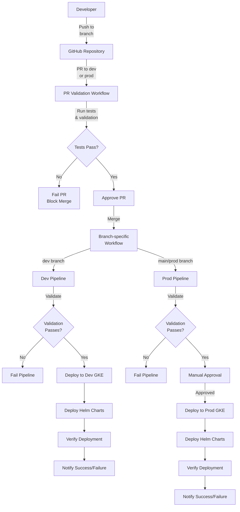

# GKE Infrastructure Automation Pipeline Implementation Guide

This guide provides detailed, step-by-step instructions for implementing the GKE infrastructure automation pipeline with GitHub Actions, Helm charts, and Terraform.

## Pipeline Architecture



## Prerequisites

Before you begin, ensure you have the following:

1. A GitHub account and repository
2. Google Cloud Platform (GCP) account with appropriate permissions
3. kubectl, Helm 3, Terraform, and Python 3.10+ installed on your local machine
4. GCP project with the following APIs enabled:
   - Kubernetes Engine API
   - Container Registry API
   - Cloud Resource Manager API
   - IAM API
   - Compute Engine API

## Implementation Steps

### Step 1: Set Up Project Directory Structure

Create the project directory structure as follows:

```bash
# Create main project directory
mkdir -p infra-automation

# Create GitHub workflows directory
mkdir -p infra-automation/.github/workflows

# Create Helm charts directories
mkdir -p infra-automation/helm/charts/gke-cluster/templates
mkdir -p infra-automation/helm/charts/security/templates
mkdir -p infra-automation/helm/charts/apis/templates
mkdir -p infra-automation/helm/environments/dev
mkdir -p infra-automation/helm/environments/prod

# Create Terraform directories
mkdir -p infra-automation/terraform/modules/gke
mkdir -p infra-automation/terraform/modules/networking
mkdir -p infra-automation/terraform/modules/service-accounts
mkdir -p infra-automation/terraform/environments/dev
mkdir -p infra-automation/terraform/environments/prod

# Create scripts and tests directories
mkdir -p infra-automation/scripts
mkdir -p infra-automation/tests/integration
mkdir -p infra-automation/tests/unit

# Change to project directory
cd infra-automation
```

### Step 2: Create GitHub Actions Workflows

#### 2.1: PR Validation Workflow

Create `.github/workflows/pr-validation.yml` with the following content:

```yaml
name: PR Validation

on:
  pull_request:
    branches:
      - main
      - dev
    paths:
      - 'helm/**'
      - 'terraform/**'
      - 'scripts/**'
      - 'tests/**'

jobs:
  validate:
    name: Validate Infrastructure Code
    runs-on: ubuntu-latest
    steps:
      - name: Checkout code
        uses: actions/checkout@v3

      - name: Set up Terraform
        uses: hashicorp/setup-terraform@v2
        with:
          terraform_version: 1.4.6

      - name: Install Helm
        uses: azure/setup-helm@v3
        with:
          version: 'v3.11.2'

      - name: Set up Python
        uses: actions/setup-python@v4
        with:
          python-version: '3.10'
          cache: 'pip'

      - name: Install Python dependencies
        run: |
          python -m pip install --upgrade pip
          pip install pytest pytest-cov checkov

      - name: Validate Terraform code
        run: |
          chmod +x ./scripts/validate_terraform.sh
          ./scripts/validate_terraform.sh

      - name: Validate Helm charts
        run: |
          chmod +x ./scripts/validate_helm.sh
          ./scripts/validate_helm.sh

      - name: Run security scan
        run: |
          chmod +x ./scripts/security_scan.sh
          ./scripts/security_scan.sh

      - name: Run unit tests
        run: |
          pytest tests/unit/

      - name: Report validation results
        if: always()
        run: |
          echo "Validation completed"
```

#### 2.2: Dev Deployment Pipeline

Create `.github/workflows/dev-pipeline.yml` with the following content:

```yaml
name: Dev Deployment

on:
  push:
    branches:
      - dev
    paths:
      - 'helm/**'
      - 'terraform/**'
      - 'scripts/**'

jobs:
  deploy:
    name: Deploy to Dev Environment
    runs-on: ubuntu-latest
    environment: development
    steps:
      - name: Checkout code
        uses: actions/checkout@v3

      - name: Set up Terraform
        uses: hashicorp/setup-terraform@v2
        with:
          terraform_version: 1.4.6

      - name: Install Helm
        uses: azure/setup-helm@v3
        with:
          version: 'v3.11.2'

      - name: Set up Python
        uses: actions/setup-python@v4
        with:
          python-version: '3.10'
          cache: 'pip'

      - name: Install Python dependencies
        run: |
          python -m pip install --upgrade pip
          pip install google-auth kubernetes pytest pytest-cov

      - name: Set up gcloud CLI
        uses: google-github-actions/setup-gcloud@v1
        with:
          project_id: ${{ secrets.GCP_PROJECT_ID }}
          service_account_key: ${{ secrets.GCP_SA_KEY }}
          export_default_credentials: true

      - name: Set up kubectl
        uses: google-github-actions/get-gke-credentials@v1
        with:
          cluster_name: ${{ secrets.DEV_GKE_CLUSTER }}
          location: ${{ secrets.GCP_REGION }}
          
      - name: Run validation
        run: |
          chmod +x ./scripts/validate_terraform.sh
          ./scripts/validate_terraform.sh

          chmod +x ./scripts/validate_helm.sh
          ./scripts/validate_helm.sh

          chmod +x ./scripts/security_scan.sh
          ./scripts/security_scan.sh

      - name: Apply Terraform (Dev)
        run: |
          cd terraform/environments/dev
          terraform init
          terraform plan -out=tfplan
          terraform apply -auto-approve tfplan

      - name: Deploy Helm Charts
        run: |
          # Deploy GKE cluster chart
          helm upgrade --install gke-cluster ./helm/charts/gke-cluster \
            -f ./helm/environments/dev/values.yaml
          
          # Deploy security chart
          helm upgrade --install security ./helm/charts/security \
            -f ./helm/environments/dev/values.yaml
          
          # Deploy APIs chart
          helm upgrade --install apis ./helm/charts/apis \
            -f ./helm/environments/dev/values.yaml

      - name: Validate Deployment
        run: |
          python ./scripts/deployment_validation.py --environment dev

      - name: Notify Success
        if: success()
        uses: slackapi/slack-github-action@v1.23.0
        with:
          payload: |
            {
              "text": "✅ Dev deployment successful! Cluster is now updated."
            }
        env:
          SLACK_WEBHOOK_URL: ${{ secrets.SLACK_WEBHOOK_URL }}

      - name: Notify Failure
        if: failure()
        uses: slackapi/slack-github-action@v1.23.0
        with:
          payload: |
            {
              "text": "❌ Dev deployment failed! Please check the GitHub Actions logs."
            }
        env:
          SLACK_WEBHOOK_URL: ${{ secrets.SLACK_WEBHOOK_URL }}
```

#### 2.3: Production Deployment Pipeline

Create `.github/workflows/prod-pipeline.yml` with the following content:

```yaml
name: Production Deployment

on:
  push:
    branches:
      - main
    paths:
      - 'helm/**'
      - 'terraform/**'
      - 'scripts/**'

jobs:
  validate:
    name: Validate Production Code
    runs-on: ubuntu-latest
    steps:
      - name: Checkout code
        uses: actions/checkout@v3

      - name: Set up Terraform
        uses: hashicorp/setup-terraform@v2
        with:
          terraform_version: 1.4.6

      - name: Install Helm
        uses: azure/setup-helm@v3
        with:
          version: 'v3.11.2'

      - name: Set up Python
        uses: actions/setup-python@v4
        with:
          python-version: '3.10'
          cache: 'pip'

      - name: Install Python dependencies
        run: |
          python -m pip install --upgrade pip
          pip install pytest pytest-cov checkov

      - name: Validate Terraform code
        run: |
          chmod +x ./scripts/validate_terraform.sh
          ./scripts/validate_terraform.sh

      - name: Validate Helm charts
        run: |
          chmod +x ./scripts/validate_helm.sh
          ./scripts/validate_helm.sh

      - name: Run security scan
        run: |
          chmod +x ./scripts/security_scan.sh
          ./scripts/security_scan.sh

      - name: Run unit tests
        run: |
          pytest tests/unit/

  deploy:
    name: Deploy to Production Environment
    needs: validate
    runs-on: ubuntu-latest
    environment: production
    steps:
      - name: Checkout code
        uses: actions/checkout@v3

      - name: Set up Terraform
        uses: hashicorp/setup-terraform@v2
        with:
          terraform_version: 1.4.6

      - name: Install Helm
        uses: azure/setup-helm@v3
        with:
          version: 'v3.11.2'

      - name: Set up Python
        uses: actions/setup-python@v4
        with:
          python-version: '3.10'
          cache: 'pip'

      - name: Install Python dependencies
        run: |
          python -m pip install --upgrade pip
          pip install google-auth kubernetes

      - name: Set up gcloud CLI
        uses: google-github-actions/setup-gcloud@v1
        with:
          project_id: ${{ secrets.GCP_PROJECT_ID }}
          service_account_key: ${{ secrets.GCP_SA_KEY }}
          export_default_credentials: true

      - name: Set up kubectl
        uses: google-github-actions/get-gke-credentials@v1
        with:
          cluster_name: ${{ secrets.PROD_GKE_CLUSTER }}
          location: ${{ secrets.GCP_REGION }}

      - name: Apply Terraform (Production)
        run: |
          cd terraform/environments/prod
          terraform init
          terraform plan -out=tfplan
          terraform apply -auto-approve tfplan

      - name: Deploy Helm Charts
        run: |
          # Deploy GKE cluster chart
          helm upgrade --install gke-cluster ./helm/charts/gke-cluster \
            -f ./helm/environments/prod/values.yaml
          
          # Deploy security chart
          helm upgrade --install security ./helm/charts/security \
            -f ./helm/environments/prod/values.yaml
          
          # Deploy APIs chart
          helm upgrade --install apis ./helm/charts/apis \
            -f ./helm/environments/prod/values.yaml

      - name: Validate Deployment
        run: |
          python ./scripts/deployment_validation.py --environment prod

      - name: Notify Success
        if: success()
        uses: slackapi/slack-github-action@v1.23.0
        with:
          payload: |
            {
              "text": "✅ Production deployment successful! Cluster is now updated."
            }
        env:
          SLACK_WEBHOOK_URL: ${{ secrets.SLACK_WEBHOOK_URL }}

      - name: Notify Failure
        if: failure()
        uses: slackapi/slack-github-action@v1.23.0
        with:
          payload: |
            {
              "text": "❌ Production deployment failed! Please check the GitHub Actions logs."
            }
        env:
          SLACK_WEBHOOK_URL: ${{ secrets.SLACK_WEBHOOK_URL }}
```

### Step 3: Create Validation Scripts

#### 3.1: Helm Validation Script

Create `scripts/validate_helm.sh` with the following content:

```bash
#!/bin/bash
set -e

echo "Running Helm chart validation..."

# Set directory paths
HELM_DIR="./helm/charts"
ENV_DIR="./helm/environments"

# Check if helm is installed
if ! command -v helm &> /dev/null; then
    echo "Error: helm is not installed"
    exit 1
fi

# Function to validate a Helm chart
validate_chart() {
    local chart=$1
    local values_file=$2
    
    echo "Validating chart: $chart with values: $values_file"
    
    # Check if chart.yaml exists
    if [ ! -f "$HELM_DIR/$chart/Chart.yaml" ]; then
        echo "Error: Chart.yaml not found in $HELM_DIR/$chart"
        return 1
    fi
    
    # Validate the chart
    helm lint "$HELM_DIR/$chart" -f "$values_file"
    
    # Template the chart to validate the templates
    helm template "$chart" "$HELM_DIR/$chart" -f "$values_file" > /dev/null
}

# Validate all charts with dev and prod values
for chart in $(ls $HELM_DIR); do
    # Skip if not a directory
    if [ ! -d "$HELM_DIR/$chart" ]; then
        continue
    fi
    
    # Validate with dev values
    if [ -f "$ENV_DIR/dev/values.yaml" ]; then
        validate_chart "$chart" "$ENV_DIR/dev/values.yaml"
    else
        echo "Warning: Dev values file not found, using default values for $chart"
        validate_chart "$chart" "$HELM_DIR/$chart/values.yaml"
    fi
    
    # Validate with prod values
    if [ -f "$ENV_DIR/prod/values.yaml" ]; then
        validate_chart "$chart" "$ENV_DIR/prod/values.yaml"
    else
        echo "Warning: Prod values file not found, using default values for $chart"
        validate_chart "$chart" "$HELM_DIR/$chart/values.yaml"
    fi
done

echo "All Helm charts validated successfully!"
```

#### 3.2: Terraform Validation Script

Create `scripts/validate_terraform.sh` with the following content:

```bash
#!/bin/bash
set -e

echo "Running Terraform validation..."

# Set directory paths
TF_MODULES_DIR="./terraform/modules"
TF_ENV_DIR="./terraform/environments"

# Check if terraform is installed
if ! command -v terraform &> /dev/null; then
    echo "Error: terraform is not installed"
    exit 1
fi

# Function to validate a Terraform directory
validate_terraform() {
    local dir=$1
    
    echo "Validating Terraform in: $dir"
    
    # Go to the directory
    cd "$dir"
    
    # Initialize terraform
    terraform init -backend=false
    
    # Validate terraform files
    terraform validate
    
    # Format check
    terraform fmt -check -recursive
    
    # Return to the project root
    cd - > /dev/null
}

# Validate all Terraform modules
for module in $(ls $TF_MODULES_DIR); do
    # Skip if not a directory
    if [ ! -d "$TF_MODULES_DIR/$module" ]; then
        continue
    fi
    
    validate_terraform "$TF_MODULES_DIR/$module"
done

# Validate all Terraform environments
for env in $(ls $TF_ENV_DIR); do
    # Skip if not a directory
    if [ ! -d "$TF_ENV_DIR/$env" ]; then
        continue
    fi
    
    validate_terraform "$TF_ENV_DIR/$env"
done

echo "All Terraform code validated successfully!"
```

#### 3.3: Security Scan Script

Create `scripts/security_scan.sh` with the following content:

```bash
#!/bin/bash
set -e

echo "Running security scan..."

# Set directory paths
HELM_DIR="./helm/charts"
TF_DIR="./terraform"

# Check if checkov is installed
if ! command -v checkov &> /dev/null; then
    echo "Installing checkov..."
    pip install checkov
fi

# Scan Terraform code
echo "Scanning Terraform code..."
checkov -d "$TF_DIR" --framework terraform --skip-check CKV_GCP_19,CKV_GCP_39 --quiet

# Scan Kubernetes resources
echo "Scanning Kubernetes (Helm) resources..."
for chart in $(ls $HELM_DIR); do
    # Skip if not a directory
    if [ ! -d "$HELM_DIR/$chart" ]; then
        continue
    fi
    
    echo "Generating Kubernetes manifests from chart: $chart"
    helm template "$chart" "$HELM_DIR/$chart" > /tmp/k8s-manifests-"$chart".yaml
    
    echo "Scanning Kubernetes manifests from chart: $chart"
    checkov -f /tmp/k8s-manifests-"$chart".yaml --framework kubernetes --skip-check CKV_K8S_37,CKV_K8S_43 --quiet
    
    # Clean up
    rm /tmp/k8s-manifests-"$chart".yaml
done

echo "Security scan completed successfully!"
```

#### 3.4: Deployment Validation Script

Create `scripts/deployment_validation.py` with the following content:

```python
#!/usr/bin/env python3

import argparse
import subprocess
import json
import sys
import time
from kubernetes import client, config

def parse_args():
    parser = argparse.ArgumentParser(description='Validate GKE cluster deployment')
    parser.add_argument('--environment', type=str, required=True, choices=['dev', 'prod'],
                        help='Environment to validate (dev or prod)')
    return parser.parse_args()

def load_kubernetes_config():
    try:
        config.load_kube_config()
        print("Successfully loaded kubeconfig")
    except Exception as e:
        print(f"Error loading kubeconfig: {e}")
        sys.exit(1)

def check_deployments():
    print("Checking deployments status...")
    v1 = client.AppsV1Api()
    
    deployments = v1.list_deployment_for_all_namespaces()
    all_ready = True
    
    for deployment in deployments.items:
        name = deployment.metadata.name
        namespace = deployment.metadata.namespace
        replicas = deployment.spec.replicas
        available = deployment.status.available_replicas or 0
        
        print(f"Deployment: {name} in {namespace} - Ready: {available}/{replicas}")
        
        if available < replicas:
            all_ready = False
    
    return all_ready

def check_pods():
    print("Checking pod status...")
    v1 = client.CoreV1Api()
    
    pods = v1.list_pod_for_all_namespaces()
    all_ready = True
    
    for pod in pods.items:
        name = pod.metadata.name
        namespace = pod.metadata.namespace
        status = pod.status.phase
        
        print(f"Pod: {name} in {namespace} - Status: {status}")
        
        if status not in ["Running", "Succeeded"]:
            all_ready = False
    
    return all_ready

def check_services():
    print("Checking services...")
    v1 = client.CoreV1Api()
    
    services = v1.list_service_for_all_namespaces()
    for service in services.items:
        name = service.metadata.name
        namespace = service.metadata.namespace
        service_type = service.spec.type
        cluster_ip = service.spec.cluster_ip
        
        print(f"Service: {name} in {namespace} - Type: {service_type}, ClusterIP: {cluster_ip}")
    
    return True

def check_cluster_resources(environment):
    print(f"Checking cluster resources for {environment} environment...")
    
    # Check nodes
    try:
        output = subprocess.check_output(["kubectl", "get", "nodes", "-o", "json"])
        nodes = json.loads(output)
        
        for node in nodes["items"]:
            name = node["metadata"]["name"]
            status = "Ready" if any(condition["type"] == "Ready" and condition["status"] == "True" for condition in node["status"]["conditions"]) else "Not Ready"
            print(f"Node: {name} - Status: {status}")
            
            if status != "Ready":
                return False
    except Exception as e:
        print(f"Error checking nodes: {e}")
        return False
    
    return True

def validate_deployment(environment):
    print(f"Starting deployment validation for {environment} environment...")
    
    # Load kubernetes config
    load_kubernetes_config()
    
    # Wait for deployments to stabilize
    print("Waiting for deployments to stabilize (30 seconds)...")
    time.sleep(30)
    
    # Run checks
    checks = [
        check_deployments(),
        check_pods(),
        check_services(),
        check_cluster_resources(environment)
    ]
    
    if all(checks):
        print(f"✅ All checks passed! The {environment} deployment is valid.")
        return True
    else:
        print(f"❌ Some checks failed! The {environment} deployment needs attention.")
        return False

if __name__ == "__main__":
    args = parse_args()
    
    if validate_deployment(args.environment):
        sys.exit(0)
    else:
        sys.exit(1)
```

### Step 4: Create GKE Terraform Environments

#### 4.1: Dev Environment

Create `terraform/environments/dev/main.tf` with the following content:

```terraform
provider "google" {
  project = var.project_id
  region  = var.region
}

# Configure the GCS backend for Terraform state
terraform {
  backend "gcs" {
    bucket = "tf-state-dev-gke-infra"
    prefix = "terraform/state"
  }
}

# Create networking infrastructure
module "networking" {
  source = "../../modules/networking"

  project_id      = var.project_id
  region          = var.region
  network_name    = "dev-vpc"
  subnetwork_name = "dev-subnet"
  subnetwork_cidr = "10.0.0.0/20"
  
  secondary_ip_ranges = {
    pods = {
      range_name    = "pods"
      ip_cidr_range = "10.16.0.0/14"
    }
    services = {
      range_name    = "services"
      ip_cidr_range = "10.20.0.0/20"
    }
  }
}

# Create service accounts
module "service_accounts" {
  source = "../../modules/service-accounts"

  project_id   = var.project_id
  environment  = "dev"
}

# Create GKE cluster
module "gke" {
  source = "../../modules/gke"

  project_id           = var.project_id
  region               = var.region
  cluster_name         = "dev-gke-cluster"
  network_name         = module.networking.network_name
  subnetwork_name      = module.networking.subnetwork_name
  master_ipv4_cidr_block = "172.16.0.0/28"
  
  master_authorized_networks = [
    {
      cidr_block   = "10.0.0.0/20"
      display_name = "VPC"
    }
  ]
  
  node_pools = [
    {
      name               = "default-pool"
      initial_node_count = 1
      min_count          = 1
      max_count          = 3
      machine_type       = "e2-standard-2"
      disk_size_gb       = 100
      disk_type          = "pd-standard"
      image_type         = "COS_CONTAINERD"
      auto_repair        = true
      auto_upgrade       = true
      preemptible        = true
    }
  ]
  
  depends_on = [
    module.networking,
    module.service_accounts
  ]
}

# Output values
output "kubernetes_cluster_name" {
  value = module.gke.cluster_name
}

output "kubernetes_cluster_endpoint" {
  value     = module.gke.cluster_endpoint
  sensitive = true
}

output "node_service_account" {
  value = module.gke.node_service_account
}
```

Create `terraform/environments/dev/variables.tf` with the following content:

```terraform
variable "project_id" {
  description = "The GCP project ID for development environment"
  default     = "my-gcp-project-dev"
}

variable "region" {
  description = "The GCP region for the GKE cluster"
  default     = "us-central1"
}
```

#### 4.2: Production Environment

Create `terraform/environments/prod/main.tf` with the following content:

```terraform
provider "google" {
  project = var.project_id
  region  = var.region
}

# Configure the GCS backend for Terraform state
terraform {
  backend "gcs" {
    bucket = "tf-state-prod-gke-infra"
    prefix = "terraform/state"
  }
}

# Create networking infrastructure
module "networking" {
  source = "../../modules/networking"

  project_id      = var.project_id
  region          = var.region
  network_name    = "prod-vpc"
  subnetwork_name = "prod-subnet"
  subnetwork_cidr = "10.0.0.0/20"
  
  secondary_ip_ranges = {
    pods = {
      range_name    = "pods"
      ip_cidr_range = "10.16.0.0/14"
    }
    services = {
      range_name    = "services"
      ip_cidr_range = "10.20.0.0/20"
    }
  }
}

# Create service accounts
module "service_accounts" {
  source = "../../modules/service-accounts"

  project_id   = var.project_id
  environment  = "prod"
}

# Create GKE cluster with high availability
module "gke" {
  source = "../../modules/gke"

  project_id           = var.project_id
  region               = var.region
  cluster_name         = "prod-gke-cluster"
  network_name         = module.networking.network_name
  subnetwork_name      = module.networking.subnetwork_name
  master_ipv4_cidr_block = "172.16.0.0/28"
  
  master_authorized_networks = [
    {
      cidr_block   = "10.0.0.0/20"
      display_name = "VPC"
    }
  ]
  
  node_pools = [
    {
      name               = "default-pool"
      initial_node_count = 3
      min_count          = 3
      max_count          = 10
      machine_type       = "e2-standard-4"
      disk_size_gb       = 100
      disk_type          = "pd-ssd"
      image_type         = "COS_CONTAINERD"
      auto_repair        = true
      auto_upgrade       = true
      preemptible        = false
    }
  ]
  
  depends_on = [
    module.networking,
    module.service_accounts
  ]
}

# Output values
output "kubernetes_cluster_name" {
  value = module.gke.cluster_name
}

output "kubernetes_cluster_endpoint" {
  value     = module.gke.cluster_endpoint
  sensitive = true
}

output "node_service_account" {
  value = module.gke.node_service_account
}
```

Create `terraform/environments/prod/variables.tf` with the following content:

```terraform
variable "project_id" {
  description = "The GCP project ID for production environment"
  default     = "my-gcp-project-prod"
}

variable "region" {
  description = "The GCP region for the GKE cluster"
  default     = "us-central1"
}
```

### Step 5: Create Terraform Service Accounts Module

Create `terraform/modules/service-accounts/main.tf` with the following content:

```terraform
variable "project_id" {
  description = "The GCP project ID"
  type        = string
}

variable "environment" {
  description = "Environment name (dev or prod)"
  type        = string
}

# Create GKE node service account
resource "google_service_account" "gke_node_sa" {
  account_id   = "gke-nodes"
  display_name = "GKE Node Service Account for ${var.environment}"
  project      = var.project_id
}

# Grant necessary permissions
resource "google_project_iam_member" "gke_node_sa_roles" {
  for_each = toset([
    "roles/logging.logWriter",
    "roles/monitoring.metricWriter",
    "roles/monitoring.viewer",
    "roles/storage.objectViewer"
  ])

  project = var.project_id
  role    = each.value
  member  = "serviceAccount:${google_service_account.gke_node_sa.email}"
}

# Create CI/CD service account
resource "google_service_account" "cicd_sa" {
  account_id   = "gke-cicd"
  display_name = "GKE CI/CD Service Account for ${var.environment}"
  project      = var.project_id
}

# Grant necessary permissions for CI/CD
resource "google_project_iam_member" "cicd_sa_roles" {
  for_each = toset([
    "roles/container.developer",
    "roles/container.admin",
    "roles/iam.serviceAccountUser",
    "roles/storage.admin"
  ])

  project = var.project_id
  role    = each.value
  member  = "serviceAccount:${google_service_account.cicd_sa.email}"
}

output "gke_node_service_account" {
  value = google_service_account.gke_node_sa.email
}

output "cicd_service_account" {
  value = google_service_account.cicd_sa.email
}
```

### Step 6: Finalize the Implementation

#### 6.1: Create README.md

Create `README.md` with the following content:

```markdown
# GKE Infrastructure Automation

This repository contains the infrastructure as code (IaC) for GK