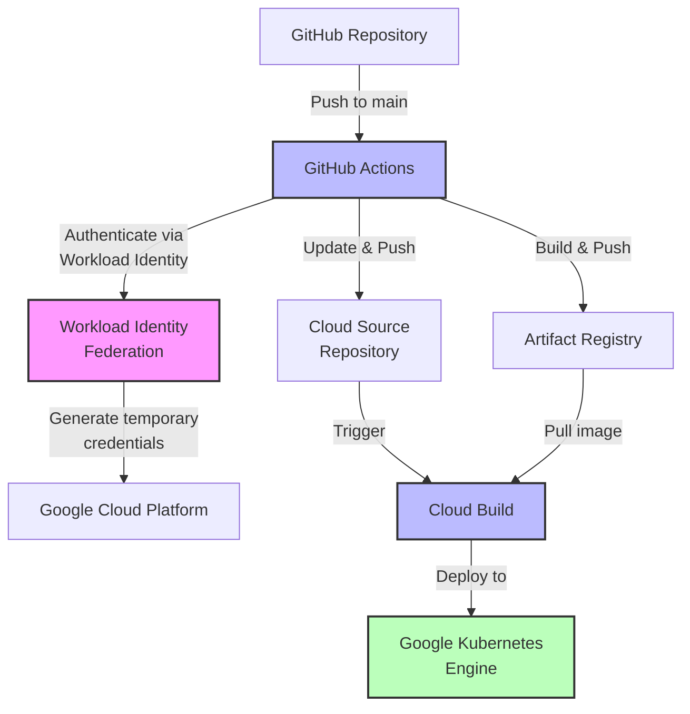
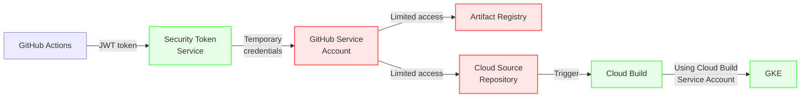
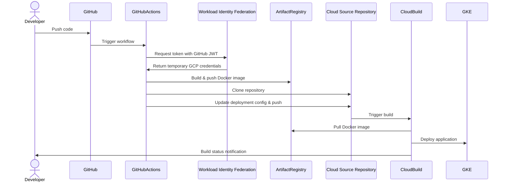

# Secure GitHub Actions to GCP Implementation Guide

This README provides a step-by-step guide to implementing a secure CI/CD pipeline using GitHub Actions and Google Cloud Platform with Workload Identity Federation.

## Directory Structure

```
secure-github-gcp/
├── .github/
│   └── workflows/
│       └── build-and-push.yml      # GitHub Actions workflow
├── k8s/
│   ├── deployment.yaml             # Kubernetes deployment manifest
│   ├── service.yaml                # Kubernetes service manifest
│   └── ingress.yaml                # Optional: Kubernetes ingress configuration
├── src/
│   ├── app/                        # Application code
│   │   ├── index.js
│   │   ├── routes/
│   │   ├── controllers/
│   │   └── models/
│   ├── tests/                      # Test files
│   │   ├── unit/
│   │   └── integration/
│   └── config/                     # Configuration files
│       └── default.js
├── scripts/
│   ├── setup.sh                    # GCP setup script
│   └── cleanup.sh                  # Optional: cleanup resources script
├── docs/
│   ├── architecture.md             # Architecture documentation
│   └── security-model.md           # Security model documentation
├── Dockerfile                      # Docker build configuration
├── .dockerignore                   # Docker build exclusions
├── cloudbuild.yaml                 # Cloud Build configuration
├── package.json                    # Node.js dependencies (if using Node.js)
├── .gitignore                      # Git exclusions
└── README.md                       # Project documentation
```

## Architecture Overview



## Security Model



## Implementation Steps

### 1. Prepare Your Local Environment

Ensure you have the following tools installed:
- Git
- Google Cloud SDK (gcloud)

```bash
# Verify Google Cloud SDK installation
gcloud --version

# Authenticate to Google Cloud
gcloud auth login

# Set your project ID
gcloud config set project YOUR_PROJECT_ID
```

### 2. Prepare Your Project Directory

Create the project structure:

```bash
# Create main project directories
mkdir -p secure-github-gcp/.github/workflows
mkdir -p secure-github-gcp/k8s
mkdir -p secure-github-gcp/src/app/routes
mkdir -p secure-github-gcp/src/app/controllers
mkdir -p secure-github-gcp/src/app/models
mkdir -p secure-github-gcp/src/tests/unit
mkdir -p secure-github-gcp/src/tests/integration
mkdir -p secure-github-gcp/src/config
mkdir -p secure-github-gcp/scripts
mkdir -p secure-github-gcp/docs

# Move into project directory
cd secure-github-gcp

# Create empty files for the project structure
touch .github/workflows/build-and-push.yml
touch k8s/deployment.yaml
touch k8s/service.yaml
touch k8s/ingress.yaml
touch src/app/index.js
touch src/config/default.js
touch scripts/setup.sh
touch scripts/cleanup.sh
touch docs/architecture.md
touch docs/security-model.md
touch Dockerfile
touch .dockerignore
touch cloudbuild.yaml
touch package.json
touch .gitignore
touch README.md

# Make scripts executable
chmod +x scripts/setup.sh
chmod +x scripts/cleanup.sh
```

### 3. Create Configuration Files

#### Create the setup script (scripts/setup.sh)

```bash
# Copy the content from the setup script artifact to the scripts directory
cp ../setup-script-content.sh scripts/setup.sh

# Make it executable
chmod +x scripts/setup.sh

# Edit the script to set your specific values
nano scripts/setup.sh
```

#### Create GitHub Actions workflow file (.github/workflows/build-and-push.yml)

```bash
# Create the workflow directory
mkdir -p .github/workflows

# Create the workflow file
nano .github/workflows/build-and-push.yml
# Copy content from the GitHub Actions workflow artifact
```

#### Create Cloud Build configuration (cloudbuild.yaml)

```bash
# Create the Cloud Build configuration file
nano cloudbuild.yaml
# Copy content from the Cloud Build Configuration artifact
```

#### Create Kubernetes manifests

```bash
# Create the Kubernetes manifests directory
mkdir -p k8s

# Create the deployment file
nano k8s/deployment.yaml
# Copy content from the Kubernetes Deployment artifact

# Create the service file
nano k8s/service.yaml
# Copy content from the Kubernetes Service artifact
```

#### Create a Dockerfile for your application

```bash
# Create a simple Dockerfile
nano Dockerfile
```

Example Dockerfile:
```dockerfile
FROM node:16-alpine

WORKDIR /app

COPY package*.json ./
RUN npm install

COPY src/ ./src/

EXPOSE 8080

CMD ["npm", "start"]
```

### 4. Set Up GCP Environment

Run the setup script to configure all required GCP resources:

```bash
# Edit the script first to set your specific values
nano scripts/setup.sh

# Run the script
./scripts/setup.sh
```

The setup script will:
1. Enable required GCP APIs
2. Create an Artifact Registry repository
3. Create a Cloud Source Repository
4. Create and configure service accounts
5. Set up Workload Identity Federation
6. Create a Cloud Build trigger

### 5. Set Up Your GitHub Repository

1. Create a new repository on GitHub
2. Push your local project to the repository:

```bash
git init
git add .
git commit -m "Initial commit"
git branch -M main
git remote add origin https://github.com/YOUR_USERNAME/YOUR_REPO.git
git push -u origin main
```

### 6. Create Sample Application Files

For a basic application setup:

```bash
# Create a simple Node.js application (if using Node.js)
cat > src/app/index.js << 'EOF'
const express = require('express');
const app = express();
const port = process.env.PORT || 8080;

app.get('/', (req, res) => {
  res.send('Hello from secure GitHub Actions to GCP pipeline!');
});

app.get('/health', (req, res) => {
  res.status(200).send('OK');
});

app.listen(port, () => {
  console.log(`App listening on port ${port}`);
});
EOF

# Create a simple package.json
cat > package.json << 'EOF'
{
  "name": "secure-github-gcp-app",
  "version": "1.0.0",
  "description": "Sample application for secure GitHub Actions to GCP pipeline",
  "main": "src/app/index.js",
  "scripts": {
    "start": "node src/app/index.js",
    "test": "echo \"Error: no test specified\" && exit 1"
  },
  "dependencies": {
    "express": "^4.18.2"
  }
}
EOF

# Create a .gitignore file
cat > .gitignore << 'EOF'
node_modules/
npm-debug.log
.DS_Store
.env
EOF

# Create a .dockerignore file
cat > .dockerignore << 'EOF'
node_modules
npm-debug.log
.git
.github
.gitignore
README.md
docs
EOF
```

### 7. Verify the Pipeline

After pushing to your GitHub repository, the following should happen automatically:

1. GitHub Actions workflow is triggered
2. GitHub Actions authenticates to GCP using Workload Identity Federation
3. Docker image is built and pushed to Artifact Registry
4. Deployment configuration is updated and pushed to Cloud Source Repository
5. Cloud Build is triggered by the change to the source repository
6. Cloud Build deploys the application to GKE

You can monitor the progress in:
- GitHub Actions tab in your repository
- Cloud Build history in the GCP Console
- GKE workloads in the GCP Console

## Workflow Sequence Diagram



## Security Considerations

1. **Principle of Least Privilege**
   - GitHub Actions service account only has permissions for Artifact Registry and Source Repositories
   - Cloud Build service account only has permissions for GKE deployment

2. **No Long-lived Credentials**
   - Using Workload Identity Federation eliminates the need for storing GCP service account keys
   - Authentication is based on temporary tokens tied to GitHub's OIDC provider

3. **Separation of Concerns**
   - GitHub Actions only handles building and pushing artifacts
   - Cloud Build handles infrastructure deployment
   - Each component has its own identity and permissions

4. **Audit Trail**
   - All actions in both GitHub and GCP are logged
   - Clear lineage from code commit to deployed infrastructure

## Troubleshooting

### GitHub Actions Authentication Issues

If GitHub Actions fails to authenticate with GCP:

1. Verify the Workload Identity Pool and Provider are correctly configured:
   ```bash
   gcloud iam workload-identity-pools describe github-pool --location=global
   gcloud iam workload-identity-pools providers describe github-provider --workload-identity-pool=github-pool --location=global
   ```

2. Check the service account binding:
   ```bash
   gcloud iam service-accounts get-iam-policy github-actions-sa@YOUR_PROJECT_ID.iam.gserviceaccount.com
   ```

### Cloud Build Trigger Issues

If Cloud Build trigger doesn't fire:

1. Verify the trigger configuration:
   ```bash
   gcloud builds triggers describe deploy-from-source-repo
   ```

2. Check Cloud Build logs for any errors:
   ```bash
   gcloud builds list --filter="source.repoSource.repoName=my-app"
   ```

### Deployment Issues

If deployment to GKE fails:

1. Check Cloud Build service account permissions:
   ```bash
   gcloud projects get-iam-policy YOUR_PROJECT_ID --filter="role:roles/container.developer"
   ```

2. Verify GKE cluster access:
   ```bash
   gcloud container clusters get-credentials my-cluster --zone us-central1-a
   kubectl get nodes
   ```

## Sample Configuration Files

### Sample Dockerfile

```dockerfile
FROM node:16-alpine

WORKDIR /app

# Copy package.json and package-lock.json
COPY package*.json ./

# Install dependencies
RUN npm install --production

# Copy application code
COPY src ./src

# Expose application port
EXPOSE 8080

# Health check
HEALTHCHECK --interval=30s --timeout=30s --start-period=5s --retries=3 \
  CMD wget -q -O - http://localhost:8080/health || exit 1

# Start the application
CMD ["npm", "start"]
```

### Sample .dockerignore

```
node_modules
npm-debug.log
.git
.github
.gitignore
README.md
docs
tests
```

### Sample .gitignore

```
# Node.js
node_modules/
npm-debug.log
yarn-error.log

# Environment variables
.env
.env.local
.env.*.local

# OS files
.DS_Store
Thumbs.db

# IDE files
.idea/
.vscode/
*.sublime-project
*.sublime-workspace

# Build files
dist/
build/
coverage/

# Logs
logs/
*.log
```

## Maintenance

To maintain this pipeline:

1. **Regularly update GitHub Actions workflows** with the latest version numbers for the actions being used
2. **Audit IAM permissions** periodically to ensure they remain at the minimum necessary level
3. **Update Docker base images** regularly to address security vulnerabilities
4. **Monitor GitHub Actions workflow runs** and Cloud Build jobs for any failures
5. **Consider implementing automated security scanning** of Docker images

## Additional Resources

- [Workload Identity Federation documentation](https://cloud.google.com/iam/docs/workload-identity-federation)
- [GitHub Actions documentation](https://docs.github.com/en/actions)
- [Cloud Build documentation](https://cloud.google.com/build/docs)
- [GKE documentation](https://cloud.google.com/kubernetes-engine/docs)
