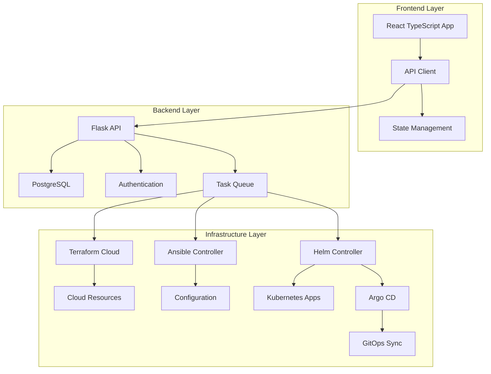

# Infrastructure Management Dashboard

A comprehensive platform for managing cloud infrastructure, configuration, and application deployments through a unified interface.

## Architecture Overview
An Example of what this Dashboard would look like is as follows:




## Project Structure

```
infrastructure-dashboard/
├── frontend/
│   ├── src/
│   │   ├── components/
│   │   │   ├── infrastructure/
│   │   │   ├── deployment/
│   │   │   └── monitoring/
│   │   ├── services/
│   │   │   ├── api/
│   │   │   └── state/
│   │   └── utils/
│   ├── public/
│   └── package.json
├── backend/
│   ├── app/
│   │   ├── api/
│   │   │   ├── infrastructure.py
│   │   │   ├── configuration.py
│   │   │   └── deployment.py
│   │   ├── services/
│   │   │   ├── terraform.py
│   │   │   ├── ansible.py
│   │   │   └── helm.py
│   │   └── models/
│   ├── migrations/
│   └── requirements.txt
├── infrastructure/
│   ├── terraform/
│   │   ├── modules/
│   │   └── environments/
│   ├── ansible/
│   │   ├── playbooks/
│   │   └── roles/
│   └── helm/
│       ├── charts/
│       └── values/
├── docker/
│   ├── frontend.Dockerfile
│   ├── backend.Dockerfile
│   └── docker-compose.yml
└── docs/
    ├── setup.md
    ├── development.md
    └── deployment.md
```

## Component Details

### Frontend (React TypeScript)

#### Key Features
- Infrastructure visualization
- Deployment management
- Configuration control
- Real-time status updates
- Role-based access control

#### Implementation
```typescript
// src/services/api/infrastructure.ts
export class InfrastructureService {
    async getResources(): Promise<Resource[]> {
        const response = await api.get('/api/v1/infrastructure/resources');
        return response.data;
    }

    async triggerDeployment(config: DeploymentConfig): Promise<Deployment> {
        const response = await api.post('/api/v1/deployments', config);
        return response.data;
    }
}

// src/components/infrastructure/ResourceList.tsx
const ResourceList: React.FC = () => {
    const [resources, setResources] = useState<Resource[]>([]);

    useEffect(() => {
        const fetchResources = async () => {
            const infraService = new InfrastructureService();
            const data = await infraService.getResources();
            setResources(data);
        };
        fetchResources();
    }, []);

    return (
        <div className="resource-list">
            {resources.map(resource => (
                <ResourceCard key={resource.id} resource={resource} />
            ))}
        </div>
    );
};
```

### Backend (Flask)

#### API Endpoints
```python
# app/api/infrastructure.py
@api.route('/infrastructure/resources', methods=['GET'])
@auth_required
def get_resources():
    terraform_service = TerraformService()
    resources = terraform_service.list_resources()
    return jsonify(resources)

@api.route('/deployments', methods=['POST'])
@auth_required
def create_deployment():
    data = request.get_json()
    deployment_service = DeploymentService()
    deployment = deployment_service.create(data)
    return jsonify(deployment)
```

#### Service Integration
```python
# app/services/terraform.py
class TerraformService:
    def __init__(self):
        self.client = TerraformClient(
            token=config.TERRAFORM_TOKEN,
            organization=config.TERRAFORM_ORG
        )

    def apply_workspace(self, workspace_id: str, variables: dict):
        run = self.client.create_run(workspace_id, variables)
        return self.client.wait_for_run(run['id'])

# app/services/ansible.py
class AnsibleService:
    def __init__(self):
        self.inventory = AnsibleInventory()
        self.runner = AnsibleRunner()

    def run_playbook(self, playbook: str, hosts: List[str], vars: dict):
        return self.runner.execute(
            playbook_path=playbook,
            inventory=self.inventory.get_hosts(hosts),
            extra_vars=vars
        )
```

### Database Schema

```sql
-- Infrastructure Resources
CREATE TABLE resources (
    id SERIAL PRIMARY KEY,
    name VARCHAR(255) NOT NULL,
    type VARCHAR(50) NOT NULL,
    provider VARCHAR(50) NOT NULL,
    status VARCHAR(50) NOT NULL,
    created_at TIMESTAMP NOT NULL,
    updated_at TIMESTAMP NOT NULL
);

-- Deployments
CREATE TABLE deployments (
    id SERIAL PRIMARY KEY,
    name VARCHAR(255) NOT NULL,
    type VARCHAR(50) NOT NULL,
    status VARCHAR(50) NOT NULL,
    config JSONB NOT NULL,
    created_at TIMESTAMP NOT NULL,
    completed_at TIMESTAMP
);

-- Configuration
CREATE TABLE configurations (
    id SERIAL PRIMARY KEY,
    resource_id INTEGER REFERENCES resources(id),
    key VARCHAR(255) NOT NULL,
    value TEXT NOT NULL,
    encrypted BOOLEAN DEFAULT false,
    created_at TIMESTAMP NOT NULL
);
```

### Infrastructure Management

#### Terraform Configuration
```hcl
# infrastructure/terraform/modules/kubernetes/main.tf
module "kubernetes_cluster" {
    source = "terraform-aws-modules/eks/aws"
    
    cluster_name    = var.cluster_name
    cluster_version = var.cluster_version
    
    vpc_id  = var.vpc_id
    subnets = var.subnet_ids
    
    node_groups = {
        main = {
            desired_capacity = 2
            max_capacity     = 4
            min_capacity     = 1
            instance_type    = "t3.medium"
        }
    }
}
```

#### Ansible Playbook
```yaml
# infrastructure/ansible/playbooks/configure_node.yml
---
- name: Configure Kubernetes Node
  hosts: kubernetes_nodes
  become: yes
  
  tasks:
    - name: Install required packages
      apt:
        name: "{{ item }}"
        state: present
      loop:
        - docker.io
        - kubernetes-cni
        - kubelet
        - kubeadm
        
    - name: Configure Docker daemon
      template:
        src: daemon.json.j2
        dest: /etc/docker/daemon.json
      notify: restart docker
```

#### Helm Chart
```yaml
# infrastructure/helm/charts/application/values.yaml
replicaCount: 2

image:
  repository: your-registry/application
  tag: latest
  pullPolicy: Always

service:
  type: ClusterIP
  port: 80

ingress:
  enabled: true
  annotations:
    kubernetes.io/ingress-class: nginx
  hosts:
    - host: app.example.com
      paths: ["/"]
```

## Setup and Deployment

### Prerequisites
- Python 3.8+
- Node.js 14+
- PostgreSQL 12+
- Docker & Docker Compose
- Terraform Cloud account
- Kubernetes cluster
- Helm 3+

### Development Setup
```bash
# Clone repository
git clone https://github.com/your-org/infrastructure-dashboard.git
cd infrastructure-dashboard

# Setup frontend
cd frontend
npm install
npm start

# Setup backend
cd ../backend
python -m venv venv
source venv/bin/activate
pip install -r requirements.txt
flask run

# Setup database
createdb infra_dashboard
flask db upgrade
```

### Production Deployment
```bash
# Build containers
docker-compose build

# Deploy
docker-compose up -d

# Initialize database
docker-compose exec backend flask db upgrade
```

## Security Considerations

### Authentication
- JWT-based authentication
- Role-based access control
- OAuth2 integration (optional)

### API Security
- Rate limiting
- Input validation
- Request signing
- SSL/TLS encryption

### Infrastructure Security
- Encrypted secrets management
- Network isolation
- Audit logging
- Access controls

## Monitoring and Logging

### Application Monitoring
- Prometheus metrics
- Grafana dashboards
- Error tracking
- Performance monitoring

### Infrastructure Monitoring
- Resource utilization
- Cost tracking
- Health checks
- Alert management

## Development Guidelines

### Code Style
- Frontend: ESLint + Prettier
- Backend: Black + isort
- Infrastructure: terraform fmt

### Testing
- Frontend: Jest + React Testing Library
- Backend: pytest
- Infrastructure: terratest

### CI/CD
```yaml
# .github/workflows/ci.yml
name: CI/CD

on:
  push:
    branches: [main]
  pull_request:
    branches: [main]

jobs:
  test:
    runs-on: ubuntu-latest
    steps:
      - uses: actions/checkout@v2
      
      - name: Frontend Tests
        run: |
          cd frontend
          npm install
          npm test
          
      - name: Backend Tests
        run: |
          cd backend
          pip install -r requirements.txt
          pytest
          
      - name: Infrastructure Tests
        run: |
          cd infrastructure
          terraform init
          terraform validate
```

## Contributing

### Development Workflow
1. Create feature branch
2. Implement changes
3. Write tests
4. Create pull request
5. Code review
6. Merge to main

### Release Process
1. Version bump
2. Changelog update
3. Tag release
4. Deploy to staging
5. Deploy to production

## Support and Documentation

### Contact Information
- Technical Support: support@example.com
- Development Team: dev@example.com
- Operations: ops@example.com

### Documentation
- API Documentation: /docs/api
- Frontend Guide: /docs/frontend
- Backend Guide: /docs/backend
- Infrastructure Guide: /docs/infrastructure
