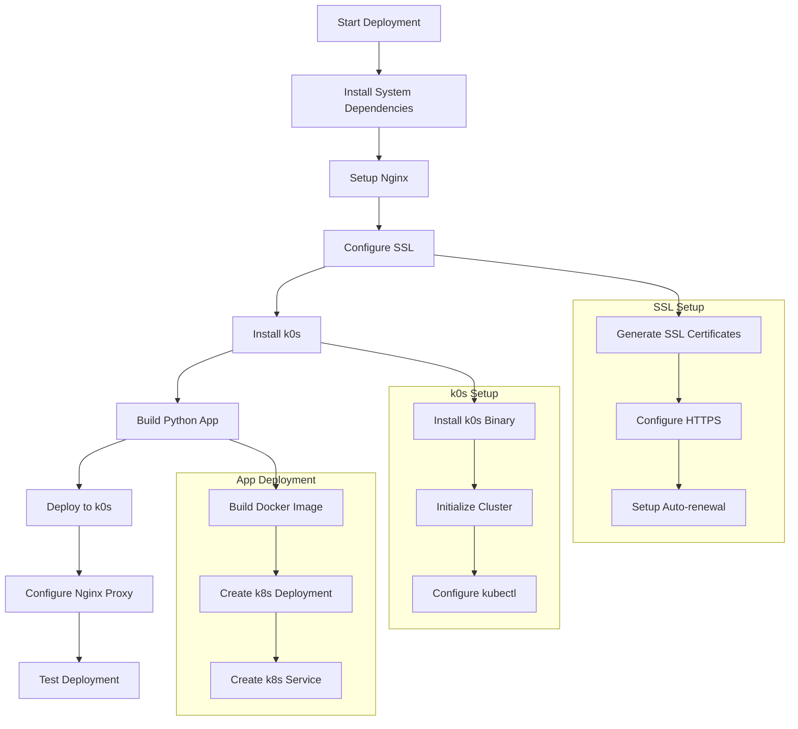

# Nginx + k0s Python Web Application Deployment

This repository contains scripts and configurations for deploying a Python web application using Nginx as a reverse proxy and k0s as a lightweight Kubernetes cluster.

## Project Structure

```
.
├── LICENSE
├── README.md
├── scripts/
│   ├── install_nginx.sh
│   ├── install_k0s.sh
│   ├── setup_ssl.sh
│   ├── deploy_app.sh
│   └── cleanup.sh
├── config/
│   ├── nginx.conf
│   ├── nginx-ssl.conf
│   └── k0s.yaml
├── app/
│   ├── Dockerfile
│   ├── app.py
│   └── requirements.txt
└── k8s/
    └── app-deployment.yaml
```

## Deployment Flow



## Prerequisites

- Ubuntu/Debian-based system
- Root or sudo access
- Git
- Docker
- Python 3.9+

## Installation Steps

### 1. Clone the Repository

```bash
git clone https://github.com/yourusername/nginx-k0s-webapp.git
cd nginx-k0s-webapp
```

### 2. Set Up Environment

```bash
# Make scripts executable
chmod +x scripts/*.sh

# Create required directories
mkdir -p /etc/nginx/ssl
```

### 3. Install and Configure Nginx

```bash
# Install Nginx and initial configuration
./scripts/install_nginx.sh

# Set up SSL (replace with your domain for production)
./scripts/setup_ssl.sh [your_domain.com]
```

### 4. Install and Configure k0s

```bash
# Install k0s
./scripts/install_k0s.sh

# Verify installation
sudo k0s status
kubectl get nodes
```

### 5. Deploy the Application

```bash
# Deploy the Python application
./scripts/deploy_app.sh

# Verify deployment
kubectl get pods
kubectl get services
```

## SSL Configuration

### Development (Self-signed certificates)
```bash
./scripts/setup_ssl.sh
```

### Production (Let's Encrypt)
```bash
./scripts/setup_ssl.sh your_domain.com
```

## Application Details

The Python application is a simple Flask web server that:
- Runs in a Docker container
- Is deployed to k0s cluster
- Is exposed via NodePort
- Is accessible through Nginx reverse proxy
- Supports both HTTP (port 80) and HTTPS (port 443)

## Testing

1. Check Nginx Status:
```bash
sudo systemctl status nginx
curl -I http://localhost
curl -I https://localhost  # Will show certificate warning with self-signed cert
```

2. Check k0s Status:
```bash
sudo k0s status
kubectl get pods -A
```

3. Check Application:
```bash
curl http://your_domain.com
curl https://your_domain.com
```

## Security Features

- TLS 1.2/1.3 support
- Automatic HTTP to HTTPS redirect
- Strong SSL cipher configuration
- HSTS enabled
- XSS protection headers
- Frame protection
- Content sniffing protection

## Maintenance

### Certificate Renewal (Let's Encrypt)
Certificates will auto-renew via cron job. To manually renew:
```bash
sudo certbot renew
```

### Cleaning Up
To remove all components:
```bash
./scripts/cleanup.sh
```

## Troubleshooting

### Common Issues

1. Nginx Configuration Errors:
```bash
sudo nginx -t
sudo journalctl -u nginx
```

2. k0s Issues:
```bash
sudo k0s status
kubectl describe pod <pod-name>
```

3. SSL Certificate Issues:
```bash
sudo certbot certificates
openssl s_client -connect your_domain.com:443 -servername your_domain.com
```

## Contributing

1. Fork the repository
2. Create your feature branch (`git checkout -b feature/amazing-feature`)
3. Commit your changes (`git commit -m 'Add amazing feature'`)
4. Push to the branch (`git push origin feature/amazing-feature`)
5. Open a Pull Request

## License

This project is licensed under the MIT License - see the LICENSE file for details.

## Acknowledgments

- k0s - https://k0sproject.io/
- Nginx - https://nginx.org/
- Let's Encrypt - https://letsencrypt.org/
