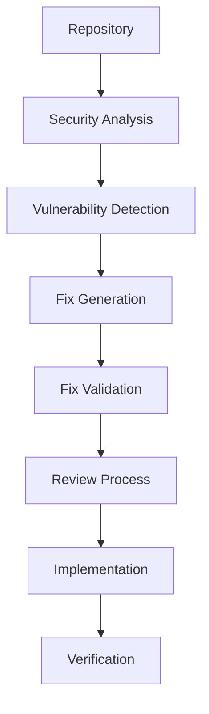

# GHAS LangChain Security Assistant

An AI-powered security analysis and remediation system that integrates GitHub Advanced Security (GHAS) with LangChain and LangGraph for automated vulnerability detection and fixing.

## Features

### 🔒 Security Analysis
- Automated code scanning and vulnerability detection
- Dependency vulnerability analysis
- Secret scanning and management
- Real-time security alerts

### 🤖 AI-Powered Remediation
- Automated fix generation for identified vulnerabilities
- Security best practices enforcement
- Intelligent fix validation
- Multi-step review process

### 🔄 GitHub Integration
- Native GHAS API integration
- GitHub Actions automation
- SARIF report generation
- Continuous monitoring

## Prerequisites

- Python 3.10 or higher
- GitHub Enterprise account with GHAS enabled
- OpenAI API key
- GitHub Personal Access Token with required permissions

## Installation

1. Clone the repository:
```bash
git clone https://github.com/your-organization/ghas-langchain-security.git
cd ghas-langchain-security
```

2. Install dependencies using Poetry:
```bash
# Install Poetry if you haven't already
curl -sSL https://install.python-poetry.org | python3 -

# Install project dependencies
poetry install
```

3. Configure environment variables:
```bash
# Create .env file
cat << EOF > .env
GITHUB_TOKEN=your_github_token
OPENAI_API_KEY=your_openai_key
GITHUB_REPOSITORY=your_org/your_repo
EOF
```

## Configuration

### GitHub Advanced Security Setup

1. Enable GHAS features in your repository:
   - Go to Repository Settings > Security & analysis
   - Enable the following features:
     - Dependency graph
     - Dependabot alerts
     - Code scanning
     - Secret scanning

2. Configure required permissions:
   - Repository Admin access
   - Security events write permission
   - Actions read permission
   - Contents read permission

### Workflow Configuration

1. Customize security analysis settings in `src/config.py`:
```python
SECURITY_CONFIG = {
    'severity_threshold': 'MEDIUM',
    'auto_fix_enabled': True,
    'review_required': True,
    'notification_channels': ['email', 'slack']
}
```

2. Set up GitHub Actions workflow:
   - The workflow is automatically configured in `.github/workflows/security-pipeline.yml`
   - Customize the schedule and trigger events as needed

## Usage

### Running Security Analysis

1. Manual execution:
```bash
# Activate virtual environment
poetry shell

# Run security analysis
python -m src.workflows.security_workflow
```

2. Automated execution:
   - Push to main branch
   - Create a pull request
   - Schedule runs (default: daily at midnight)

### Viewing Results

1. GitHub Security Overview:
   - Navigate to Security tab in your repository
   - View Code scanning alerts
   - Check Dependabot alerts
   - Monitor Secret scanning alerts

2. Generated Reports:
   - SARIF reports in GitHub Security
   - Automated issue creation
   - Pull request comments

### Agent Interactions

The system uses three main agents:

1. SecurityAgent:
   - Analyzes repository for vulnerabilities
   - Prioritizes issues based on severity
   - Generates detailed security reports

2. RemediationAgent:
   - Generates fixes for identified issues
   - Implements security best practices
   - Validates proposed changes

3. ReviewAgent:
   - Reviews generated fixes
   - Ensures compliance with security policies
   - Approves or rejects changes

## Workflow Architecture



## Customization

### Adding Custom Tools

1. Create new tool in `src/tools`:
```python
from langchain.tools import BaseTool

class CustomSecurityTool(BaseTool):
    def __init__(self):
        # Tool initialization

    @tool
    def custom_analysis(self, input_data):
        # Tool implementation
```

2. Register tool in workflow:
```python
workflow.add_tool(CustomSecurityTool())
```

### Modifying Agents

1. Update agent prompts in `src/agents`:
```python
class CustomAgent:
    def __init__(self):
        self.prompt = ChatPromptTemplate.from_messages([
            ("system", "Custom system message"),
            ("user", "{input}")
        ])
```

2. Customize agent behavior:
```python
async def custom_analysis(self, data):
    # Custom analysis implementation
```

## Troubleshooting

### Common Issues

1. Authentication Errors:
   - Verify GitHub token permissions
   - Check OpenAI API key validity
   - Ensure GHAS is enabled

2. Workflow Failures:
   - Check GitHub Actions logs
   - Verify repository permissions
   - Validate configuration settings

3. Agent Errors:
   - Review OpenAI API quotas
   - Check network connectivity
   - Verify input data format

## Contributing

1. Fork the repository
2. Create a feature branch
3. Commit your changes
4. Push to the branch
5. Create a Pull Request

## Security

- Report security issues through GitHub Security Advisories
- Keep dependencies updated
- Follow security best practices
- Review automated fixes before implementation

## License

This project is licensed under the MIT License - see the LICENSE file for details.

## Support

- GitHub Issues for bug reports and feature requests
- GitHub Discussions for general questions
- Project wiki for documentation
- Security advisories for vulnerability reports

## Acknowledgments

- GitHub Advanced Security team
- LangChain community
- OpenAI
- Contributors and maintainers