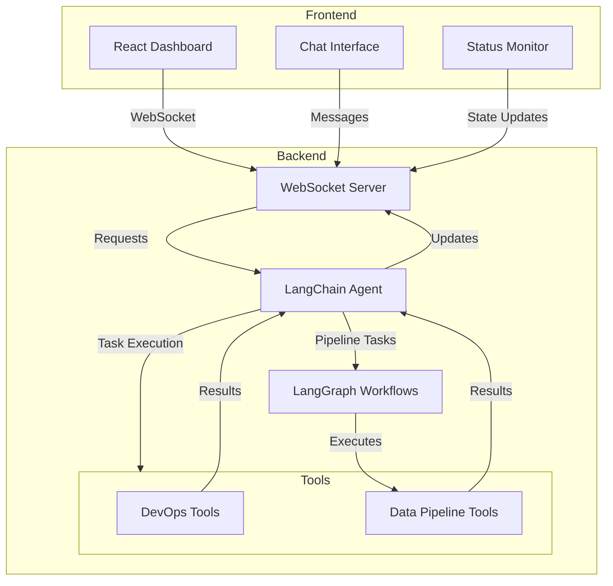

# AI-Powered DevOps & Data Engineering Automation System

This system combines LangChain agents and LangGraph workflows to create an intelligent automation platform for DevOps and data engineering tasks, complete with a real-time dashboard interface.

## System Architecture



## Directory Structure

```
ai-automation/
├── backend/
│   ├── __init__.py
│   ├── main.py                    # FastAPI application
│   ├── agent/
│   │   ├── __init__.py
│   │   ├── automation_agent.py    # Combined agent implementation
│   │   └── tools.py              # Tool definitions
│   ├── workflows/
│   │   ├── __init__.py
│   │   └── graph.py              # LangGraph workflow definitions
│   └── utils/
│       ├── __init__.py
│       └── state.py              # State management classes
├── frontend/
│   ├── src/
│   │   ├── components/
│   │   │   ├── Dashboard.jsx     # Main dashboard component
│   │   │   ├── ChatInterface.jsx # Chat implementation
│   │   │   └── StatusMonitor.jsx # Status display
│   │   ├── App.jsx
│   │   └── main.jsx
│   ├── package.json
│   └── vite.config.js
└── README.md
```

## Implementation Steps

### 1. Environment Setup

```bash
# Create project directory
mkdir ai-automation
cd ai-automation

# Set up Python virtual environment
python -m venv venv
source venv/bin/activate  # On Windows: .\venv\Scripts\activate

# Install backend dependencies
pip install fastapi uvicorn langchain langgraph openai websockets

# Create frontend project
npm create vite@latest frontend -- --template react
cd frontend
npm install
npm install @radix-ui/react-alert-dialog @radix-ui/react-slot lucide-react tailwindcss
```

### 2. Backend Implementation

1. Set up the FastAPI application (`backend/main.py`):
```python
from fastapi import FastAPI, WebSocket
from agent.automation_agent import AutomationAgent

app = FastAPI()

@app.websocket("/ws")
async def websocket_endpoint(websocket: WebSocket):
    # Implementation as shown in the backend code artifact
```

2. Create the automation agent (`backend/agent/automation_agent.py`):
```python
# Implementation from the combined-backend artifact
```

3. Configure environment variables:
```bash
# Create .env file
echo "OPENAI_API_KEY=your-key-here" > .env
```

### 3. Frontend Implementation

1. Set up Tailwind CSS:
```bash
# Install Tailwind
npm install -D tailwindcss postcss autoprefixer
npx tailwindcss init -p
```

2. Configure Tailwind (`tailwind.config.js`):
```javascript
module.exports = {
  content: ["./src/**/*.{js,jsx,ts,tsx}"],
  theme: {
    extend: {},
  },
  plugins: [],
}
```

3. Implement the dashboard components as shown in the dashboard-frontend artifact.

### 4. Running the System

1. Start the backend server:
```bash
# From the project root
cd backend
uvicorn main:app --reload
```

2. Start the frontend development server:
```bash
# From the project root
cd frontend
npm run dev
```

3. Access the dashboard at `http://localhost:5173`

## Usage Examples

### DevOps Tasks

```plaintext
# Deployment
User: "Deploy the user-service to staging environment"
Agent: "I'll help you deploy the service. Let me execute that for you..."

# Scaling
User: "Scale the authentication service to 5 replicas"
Agent: "I'll scale up the service. Let me handle that..."
```

### Data Pipeline Tasks

```plaintext
# ETL Pipeline
User: "Run the daily ETL pipeline for customer data"
Agent: "I'll initiate the ETL workflow. Here's the progress..."

# Data Transformation
User: "Transform the sales data and load it into the analytics database"
Agent: "Starting the data pipeline workflow..."
```

## Common Issues and Solutions

1. WebSocket Connection Issues:
   - Ensure the backend server is running
   - Check CORS settings in the FastAPI application
   - Verify the WebSocket URL in the frontend code

2. Agent Response Delays:
   - Monitor OpenAI API rate limits
   - Implement retry logic for failed requests
   - Add timeout handling in the frontend

3. Workflow State Management:
   - Implement proper error handling in the workflow graph
   - Add state persistence for long-running workflows
   - Include cleanup procedures for failed workflows

## Security Considerations

1. API Key Protection:
   - Use environment variables for sensitive data
   - Implement proper key rotation procedures
   - Never expose API keys in the frontend code

2. Access Control:
   - Implement authentication for WebSocket connections
   - Add role-based access control for different operations
   - Log all system actions for audit purposes

3. Data Security:
   - Encrypt sensitive data in transit
   - Implement proper data retention policies
   - Regular security audits of the deployment

## Monitoring and Maintenance

1. System Health Checks:
   - Monitor WebSocket connection status
   - Track agent response times
   - Log workflow execution metrics

2. Performance Optimization:
   - Implement caching where appropriate
   - Optimize database queries
   - Use connection pooling

3. Regular Updates:
   - Keep dependencies up to date
   - Monitor for security advisories
   - Regular code reviews and updates

## Contributing

1. Fork the repository
2. Create a feature branch
3. Make your changes
4. Submit a pull request

## License

MIT License - Feel free to use this code for your projects.