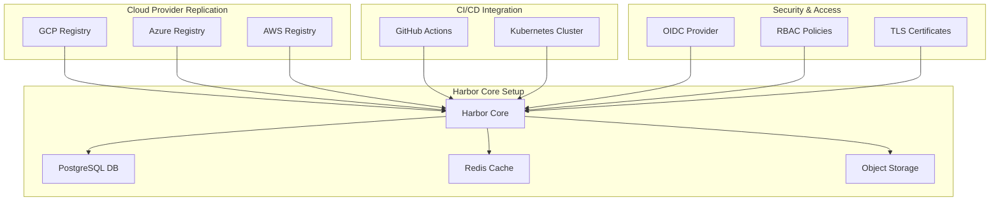

# Harbor Multi-Cloud Container Registry

This repository contains infrastructure code and configuration for deploying Harbor Container Registry with multi-cloud replication to GCP, Azure, and AWS.

## Architecture Overview



## Repository Structure

```
.
├── .github/
│   └── workflows/
│       ├── deploy.yaml
│       └── replicate.yaml
├── kubernetes/
│   ├── base/
│   │   ├── harbor-core.yaml
│   │   ├── postgresql.yaml
│   │   └── redis.yaml
│   └── overlays/
│       ├── production/
│       ├── staging/
│       └── development/
├── terraform/
│   ├── aws/
│   ├── azure/
│   ├── gcp/
│   └── modules/
│       ├── harbor/
│       ├── storage/
│       └── networking/
├── config/
│   ├── harbor.yml
│   └── replication/
│       ├── aws-policy.yaml
│       ├── azure-policy.yaml
│       └── gcp-policy.yaml
└── scripts/
    ├── install.sh
    ├── upgrade.sh
    └── backup.sh
```

## Features

- Harbor container registry deployment with high availability
- Multi-cloud replication across GCP, Azure, and AWS
- GitHub Actions integration for automated deployments
- Automated container distribution and synchronization
- Role-based access control (RBAC) and security policies
- Monitoring and alerting setup

## Prerequisites

- Kubernetes cluster (v1.20+)
- Helm 3.x
- kubectl CLI tool
- Cloud provider credentials (GCP, Azure, AWS)
- GitHub account
- Domain name for Harbor
- SSL/TLS certificates

## Installation

1. Clone the repository:
```bash
git clone https://github.com/your-org/harbor-multicloud.git
cd harbor-multicloud
```

2. Configure cloud provider credentials:
```bash
# AWS
export AWS_ACCESS_KEY_ID="your-access-key"
export AWS_SECRET_ACCESS_KEY="your-secret-key"

# Azure
az login

# GCP
gcloud auth application-default login
```

3. Update configuration:
```bash
cp config/harbor.yml.example config/harbor.yml
# Edit harbor.yml with your specific settings
```

4. Deploy Harbor:
```bash
./scripts/install.sh
```

## Configuration

### Harbor Core Settings

Edit `config/harbor.yml` to configure:
- Database settings
- Storage backend
- Authentication
- Security policies
- Logging and monitoring

### Replication Rules

Configure replication in `config/replication/`:
- Target registries
- Replication schedules
- Image filtering
- Network policies

### RBAC Setup

Define roles and permissions in `kubernetes/base/harbor-core.yaml`:
- User roles
- Project access
- Resource quotas
- Authentication policies

## GitHub Actions Integration

This repository includes CI/CD workflows for:
- Automated deployments
- Configuration validation
- Security scanning
- Replication verification

## Monitoring

Harbor deployment includes:
- Prometheus metrics
- Grafana dashboards
- Alert configurations
- Health checks

## Backup and Recovery

Execute backup procedures:
```bash
./scripts/backup.sh
```

Backup includes:
- Database dumps
- Configuration files
- Image metadata
- Access policies

## Security Considerations

- Enable HTTPS/TLS
- Configure authentication
- Regular security scanning
- Network policy enforcement
- Access logging
- Vulnerability scanning

## Troubleshooting

Common issues and solutions:
- Replication failures
- Authentication errors
- Storage issues
- Network connectivity

## Contributing

1. Fork the repository
2. Create a feature branch
3. Submit a pull request

## License

This project is licensed under the MIT License - see the LICENSE file for details.

## Support

For issues and support:
- Create a GitHub issue
- Check documentation
- Contact maintainers

